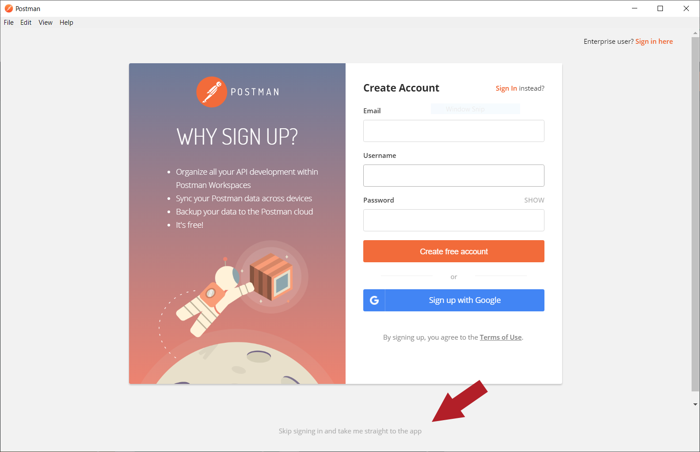
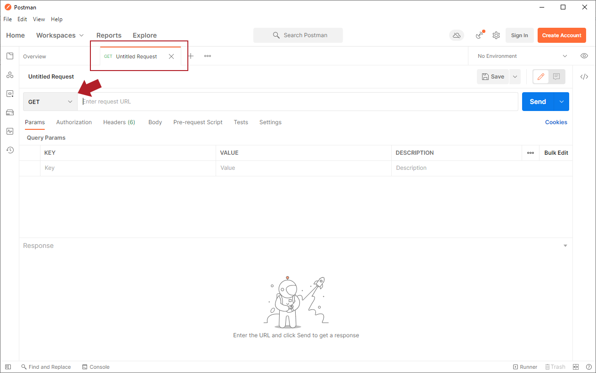
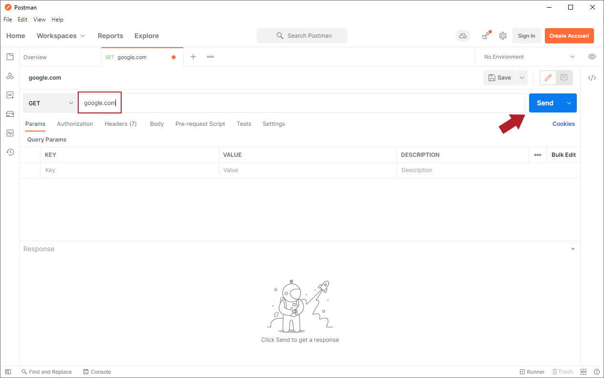
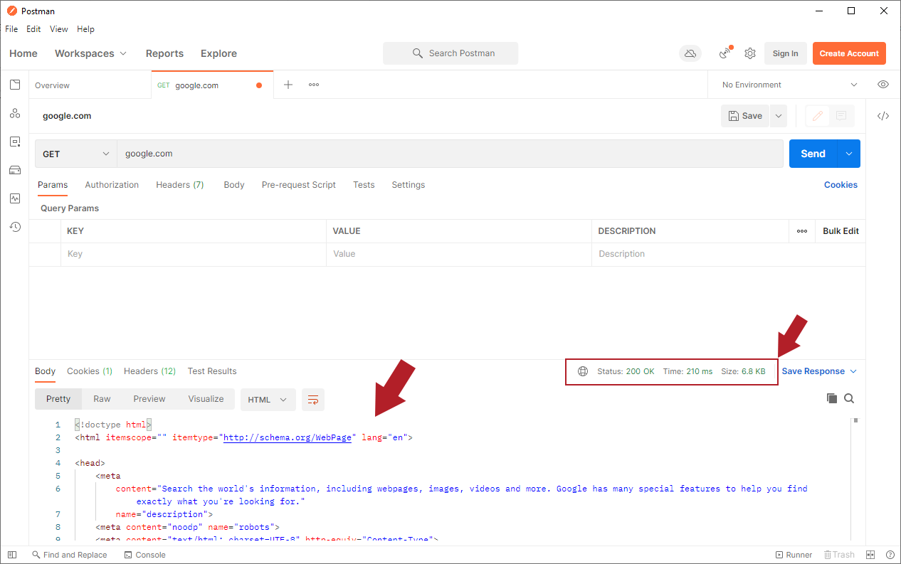
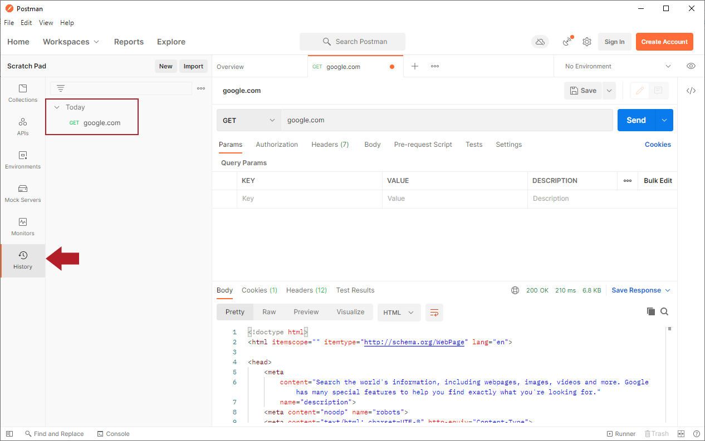

# REST Web Services

## Getting Started with Postman

### 1. Install Postman

Install Postman to your computer.

* Start at Postman's Downloads page.
* Download the version appropriate for your operating system and run the installation file.

Once the application is installed, open the installed application.

You may be prompted to log in. If you wish to create and use an account in Postman, you may do so. Otherwise, simply click the link at the bottom of the page to skip the login process and go straight to Postman.

Postman includes multiple tools and views. You are welcome to explore a bit, but the main areas that we will use are the tabs area on the right and the History pane on the left.

### 2. Send an HTTP Request

The most common reason to use Postman is to test HTTP requests. An HTTP request is a message sent from a browser (or similar client) to a web server to request specific information. Any web application must be programmed to accept and respond to HTTP requests, and during the development phases, before the code is fully built, developers can use a tool like Postman to check that specific requests work as expected, both to help write the code that will handle these requests and to troubleshoot problems if the program isn't behaving as expected.

GET is the most frequently used HTTP request. Every time a user opens a web page, the browser sends a GET request to the server to ask the server to deliver the contents of the requested page. Let's use Postman to send a GET request to Google.com to see what this looks like.

In the Get started menu on the right, click Create a request. This will open a new tab labeled GET and named Untitled Request. In the screenshot below, we have also closed the left pane using the View/Toggle sidebar (Ctrl-V) to make the request area larger.

A new tab will typically start as a GET request because that is the most common type of request. You can then enter a URL in the field to the right of the GET option. Here we enter google.com:

### 3. View the Results

Click the Send button to send the request to the server. Assuming the Google server is available, it will return the contents of its home page in HTML format. The page contents will appear in the Body pane at the bottom of the window.

Some things to note here:

* You have the option of saving this request and its response. This can be useful if you are working on a project and want to send the same request multiple times or in case you need to compare responses from one run to the next.
* The HTML code appears on the Body tab of the response pane. You can also view any cookies or headers associated with the request on the corresponding tabs.
* To the right of the tabs, Postman provides other useful information about the request. Most importantly is the Status: 200 OK message. Every request returns a status with a specific number. 200 means that the request was successful.

The HTML code is the same code that a browser would receive and render to the user.

### 4. The History Pane

Another useful feature of Postman is that it automatically keeps track of the requests you send, and this history appears in the History pane on the left.

The History pane allows you to view the requests you have already sent. To resend a request, click the request in the History pane to open it and then click Send to resend.

Each request will also appear in its own tab in the main pane, which allows you to easily re-run requests you have already run.