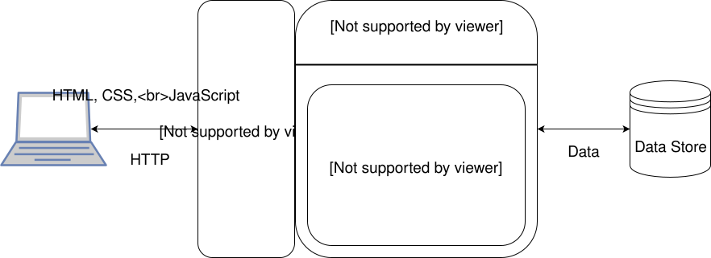
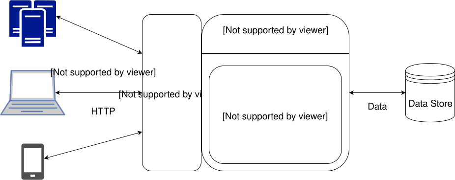
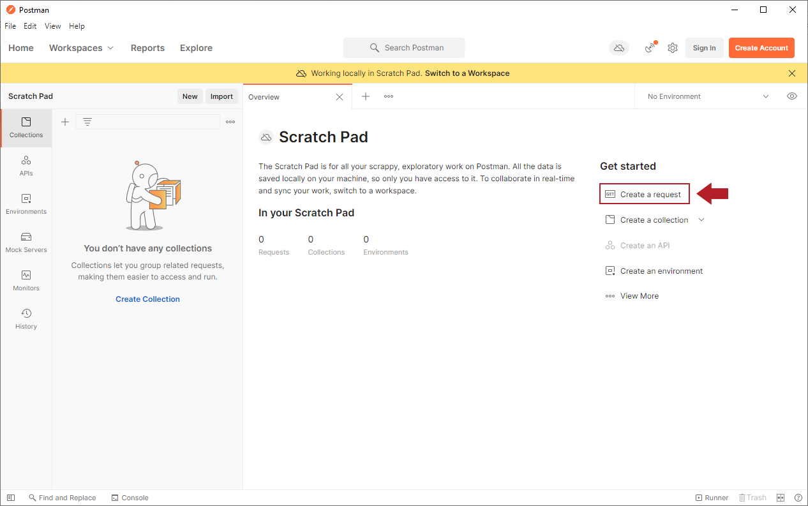
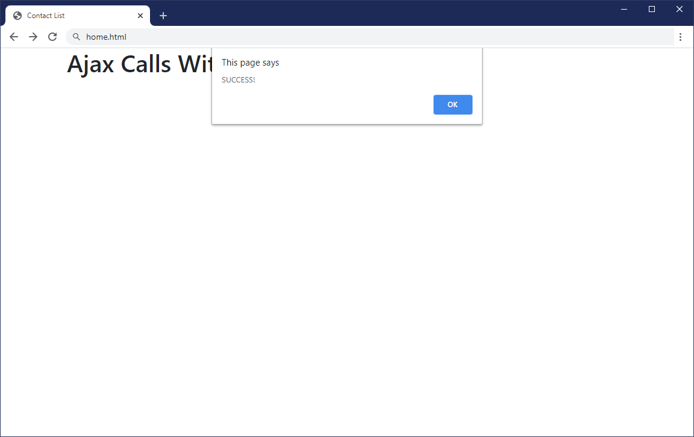
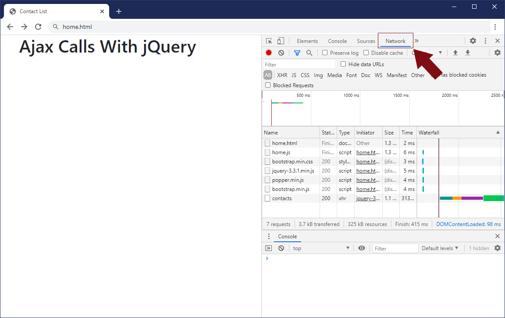
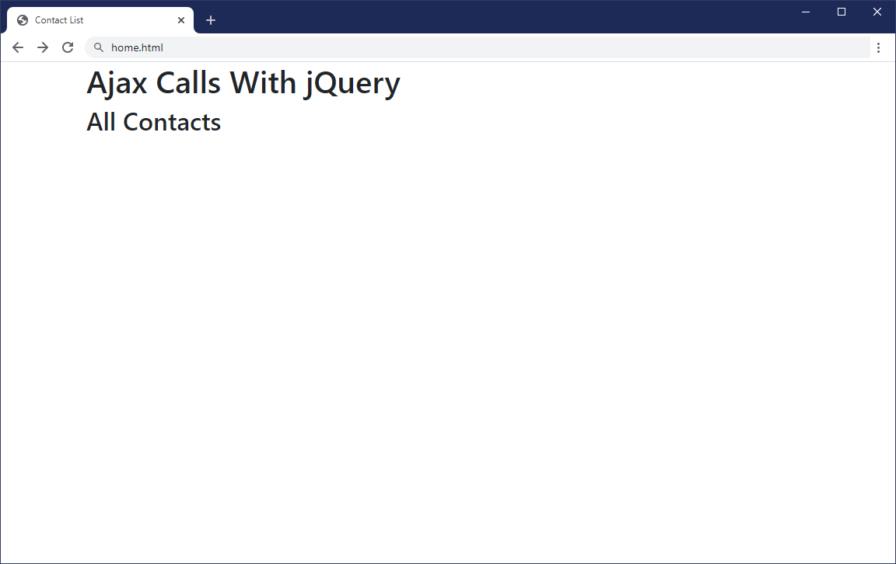

# REST Web Services

## Ajax

### 1. Why Ajax?

In the original days of the World Wide Web, communication streamed from a server to a client in the form of web pages, and it was an all-or-nothing proposition. If you wanted to see updated content on a page, you had to refresh everything on the page, which was sometimes painful because Internet speeds were extremely slow by today's standards. 

#### 1.1. Conventional Web Apps vs. Ajax/Web Service Model

Here are the main differences between traditional web applications and web services:

In a traditional web application, the client computer communicates with the web server using HTML, CSS, and JavaScript, and the web server works with an interpreter component to execute web application code. That code can pull content from a separate data store and include the data in the output. The web server accepts that output, converts it to HTML, and returns the content to the client computer.

Using this traditional approach, the entire page (including data pulled from a data remote data store and the results of any calculations based on that data) is built on the server, and the page is transferred through a web server to the client over HTTP. The client browser uses HTML, CSS, and JavaScript to interpret and display the page it receives from the server.

In a more modern web service scenario, the web server can interact with a network server, a client computer, or even a mobile device, and deliver data directly to the end user using JSON or other web-friendly data formats. A local browser or similar app then renders the content locally, incorporating the new data.

There is one more important difference between traditional web applications and web services. In the traditional web application model, all of the processing and logic of the application resides on the server: the browser is used only to display the results. In a web service, processing and logic still reside on the server but some of the processing and logic can also reside in the browser in the form of JavaScript code. In the web service architecture, the code running in the browser is a separate program in and of itself that makes Ajax calls, processes data, performs calculations, and updates the display as needed. 

### 2. What is Ajax?

Ajax (which stands for Asynchronous JavaScript And XML) is a combination of technologies that us implement the more efficient web services. Clients (usually JavaScript code running in a web browser) use Ajax to exchange data with web services. This approach is used extensively in modern web applications to help give them the feel of a desktop application. This smoother desktop feel is possible because the HTML page does not reload when making an Ajax call. The Ajax call is made, data is returned from the web service, and then JavaScript code dynamically updates only the portions of the page that need to be updated.

Here are the big pieces that make up Ajax:

#### 2.1. XMLHttpRequest (XHR)

This is the piece that makes it possible for JavaScript code running in the browser to exchange data with the server. We'll take a closer look at XHR in the next section.

#### 2.2. JavaScript

We'll use a combination of plain old JavaScript and the jQuery JavaScript library to make XHR calls, process the returned data, and update the HTML page with the results of the XHR calls.

#### 2.3. HTML and CSS

HTML and CSS are what we'll use to build our user interface. As mentioned in the previous item, we'll use jQuery and JavaScript to update the HTML and CSS based on the results of XHR calls.

#### 2.4. JSON or XML

Ajax generally uses either JSON or XML format to exchange data between client and server.

XML is a data format that allows us to define datasets using Key:Value pairs, but note that we are not limited to using XML to format our data when using Ajax, because it also supports data in JSON format.

We will use JSON exclusively in this course. JSON has a similar structure to XML, but with different formatting. 

### 3. XMLHttpRequest (XHR)

At this point, you should already be familiar with JavaScript, HTML, CSS, and JSON, but XHR is likely to be new, so let's look at it in more detail.

XHR is an application programming interface, or API, that allows JavaScript code to exchange data with web services by exchanging requests and responses over HTTP or HTTPS. Although we could make these calls directly in our JavaScript code, there are several libraries available, including jQuery, that wrap XHR with code that makes it more convenient to make Ajax calls. We'll be using the jQuery library to make all of our Ajax calls.

#### 3.1. History

XHR was created by Microsoft to support web access to Outlook email and it originally appeared in Internet Explorer. Mozilla Firefox added support soon after. The two implementations were quite similar but there were several small differences. In order to smooth the differences and promote interoperability, the Firefox team created the XMLHttpRequest JavaScript API, which became the de facto standard for XHR.

#### 3.2. CORS

One of the biggest issues with web-based communication is the fact that we can literally connect any server to any page using hyperlink technology. We can freely embed content like images and videos from other domains into our web pages (barring copyright and other legal issues) using HTML and CSS, but we typically do not want to make Ajax calls that cross domains for security reasons.

By default, all browsers enforce the same origin policy. This policy enforces the rule that JavaScript code running in the browser is only allowed to make calls back to the domain of its page. For example, JavaScript code running in a page from\

www.example.com can only make calls back to www.example.com. The browser would prevent calls back to www.anotherdomain.com or any other domain for that matter.

There are some situations where we don't want the browser to follow this policy. One example is if your HTML pages are served up from www.example.com but your client code makes calls back to web services on another subdomain like services.example.com. Another example where you might not want to enforce this policy is if you are hosting some resource (fonts or icons for example) that you want to make available to anyone and everyone.

To accommodate these kinds of situations we can use Cross-Origin Resource Sharing (CORS). CORS allows some resource sharing across domains – it is not a free for all but allows the HEAD, GET, and POST HTTP methods. POST is restricted to only plain text, multipart form, and URL encoded MIME types. CORS gives the web service designer a lot of flexibility in controlling cross-origin requests. Here are the options we have when using CORS:

* Fully enforce the same origin security policy and allow no cross-origin requests.
* Allow cross-origin requests from certain domains but not from others. In this case, the web server maintains a whitelist of allowed domains – access is denied to all except those on the list.
* Allow cross-origin requests from all domains.
* Allow cross-origin requests from only certain domains (as in #2 above) but also allow preflight requests where the client asks if it has permission to perform HTTP methods other than HEAD, GET, and POST. The server responds to preflight requests by letting the client know if it has any access at all and, if the client does have access, lets the client know what HTTP methods it is allowed to perform.

For more information about CORS, see the Wikipedia article, Cross-origin resource sharing. 

### 4. Making an Ajax Call with jQuery

Now we'll take a closer look at how all this actually works using an existing web service. Before going on, though, check to make sure that the following link works:

    http://contactlist.us-east-1.elasticbeanstalk.com/

When you click that link, a new tab should open with a welcome message. If you get a 404 error instead, verify that the URL is correct and contact your instructor if you continue to have problems. 

#### 4.1. Postman

It's useful to use Postman to experiment with HTTP requests before writing code that makes those requests. Postman allows you to make calls, send data, and receive data back from the service very easily and transparently so you know exactly what to expect when you begin coding.

If you don't already have Postman installed on your computer, use the following steps to install the app:

* Go to www.getpostman.com/downloads in your browser
* Click on the Download the app button
* Run the install file using the default settings
* Start Postman from your OS

Alternatively, if you don't want to install the app on your computer, you can use Postman on the Web, which requires a free account. Instructions for this option are included on the Postman Download page. You do not need an account to use the installed app from your computer. 

#### 4.2. Retrieve a List of Contacts

We're not going to look at everything in the Contact List web service in this lesson (we'll look at the entire Contact List API in later lessons). Instead, we will look at two endpoints:

* Getting all the contacts
* Creating a new contact

The term endpoint here refers to the URL you will use to perform the HTTP service you want to complete. REST typically includes endpoints that allow you to retrieve all records in a data set, retrieve a specific record, delete a specific record, and update a specific record. These endpoints are typically defined in the API itself, so from our current perspective, we just need to know what URLs to use for specific actions on the data.

> Note
We are using a live web service for this exercise. Because users (including other students using the API at the same time you are) can change the data stored in the API, the data you see on your computer may not match what is shown in the screenshots below. Rather than focusing on the data itself, focus on the kind of data you see to verify your results. If you see unexpected errors in your results, review the steps you completed to make sure you did them correctly. Contact an instructor if you have questions or can't resolve problems on your own.

We'll look at the endpoint for getting all the contacts first. 

The endpoint for getting all the contact from the service looks like this (we'll look at the entire API in a later lesson):

        HTTP Method: GET
        Endpoint URL: http://contactlist.us-east-1.elasticbeanstalk.com/contacts
        RequestBody: None
        ResponseBody: JSON array of all the contacts from the service

Making a call to this endpoint is straightforward in Postman. If necessary, click the new tab button in the main pane of Postman. Select GET as the HTTP method (this is the default), type the API address http://contactlist.us-east-1.elasticbeanstalk.com/contacts into the Enter request URL field, and then hit Send.

Your screen should look like this:

The Contact List service has returned an array of contacts and each contact has fields for contact id, first name, last name, company, phone, and email in the body pane. This is very helpful – now we know exactly what to expect when we make this call in our code. 

#### 4.3. Ajax Calls using the jQuery Library

Now let's see how we can use jQuery to replicate what we just did in Postman.

Download the following zip file and extract the files to your classwork repository for this course:

    AjaxWithjQuery.zip

You should see a home.html page in the new folder, as well as a js subfolder.

Create a file named home.js inside the subfolder. Add the following code to the new file:

        $(document).ready(function(){
        
            $.ajax({
                type: 'GET',
                url: 'http://contactlist.us-east-1.elasticbeanstalk.com/contacts',
                success: function() {
                    alert('SUCCESS!');
                },
                error: function() {
                    alert('FAILURE!');
                }
            })
        
        })

We start with the document.ready statement we've seen in jQuery already, and then we add an .ajax method. This method requires four parameters, which we present in an array (inside { }).

* The first parameter is type, which refers to the type of HTTP request we want to sent. In this case, we are simply retrieving data, so we use 'GET'.
* For url, we use the same endpoint we used in Postman: http://contactlist.us-east-1.elasticbeanstalk.com/contacts
* We also specify what the program should do if the GET succeeds. In this case, call an alert.
* Similarly, we specify what the program should do if the GET fails. Again, call an alert here.

Save the changes and open home.html in your browser.

If you see the SUCCESS! alert, everything is working as expected. If you see FAILURE!, check that the endpoint URL was entered correctly and that the same URL works on a GET request in Postman.

If you don't see either alert (for success or failure), check that all the code is correct and that all changes have been saved to both files, then refresh the page.

The alert message is good as quick check to make sure the call was successful, but remember that we actually got data back from the API when we ran the same request in Postman. Where did that data go?

Open the developer tools in the browser window. The F12 key normally works for this, or you can right-click and select the Inspect option in the context menu. In the Developer pane, click the Network tab.

The table in that pane shows the results for all components in the webpage, including the .css and .js files we included in the home page. At the bottom of the table, you should see contacts, which represents the endpoint of our call. Click the word contacts and, if necessary, click the Preview tab in that pane to see the list of contacts returned from the API in JSON format.

Because we don't want to force our users to open the developer pane to see this data, we can use jQuery to add the data to the webpage itself. 

#### 4.2. Display Results in Web Page

Open the home.html file in your code editor.

The first thing we need to do is create a landing spot where we want the retrieved data to appear on the page. Update the page to include a new div under the main heading:

        <body>
    
        

            <h1 id="mainHeading">Ajax Calls With jQuery</h1>
        

    
        

            <h2>All Contacts</h2>
            

            

        

Note that each div is defined as a separate Bootstrap container. After making these changes, the page be empty except for the two titles.

Now we can use jQuery to add the data to the page.

When we added the Ajax call, we had it display the Success alert if the call was successful, but we've seen that that output isn't very useful. Instead, we will have jQuery plug the data into the empty `allContacts` div.

In the home.js file, we need to update the function for the success parameter in the ajax method. Because we are receiving an array of contacts from the server, we'll name the success function's parameter contactArray. We can also delete the SUCCESS alert because if the GET is successful, we will see the data from the dataset.

        $.ajax({
            type: 'GET',
            url: 'http://contactlist.us-east-1.elasticbeanstalk.com/contacts',
            success: function(contactArray) {
        
            },
            error: function() {
                alert('FAILURE!');
            }
        })

Next, we create a variable and use jQuery to connect the variable to the allContacts div we just added to the html page.

        $.ajax({
            type: 'GET',
            url: 'http://contactlist.us-east-1.elasticbeanstalk.com/contacts',
            success: function(contactArray) {
                var contactsDiv = $('#allContacts');
            },
            error: function() {
                alert('FAILURE!');
            }
        })

Next, we need to loop through the array of data to retrieve the individual values in the collection. We'll use the each function to do this in jQuery and then append each record to the data in the div using HTML.

        $.each(contactArray, function(index, contact) {
            var contactInfo = '
';
            contactInfo += 'Name: ' + contact.firstName + ' ' + contact.lastName + ' ';
            contactInfo += 'Company: ' + contact.company + ' ';
            contactInfo += 'Email: ' + contact.email + ' ';
            contactInfo += 'Phone: ' + contact.phone + ' ';
            contactInfo += '

';
        
            contactsDiv.append(contactInfo);
        })

This code creates a new variable contactInfo that includes the following:

* Open a new paragraph (
) for each record.
* Add the label Name to the first line, concatenated with the contact's first and last names
* Add the label Company to the next line, along with the name of the business.
* Do the same for email and phone.
* Close the paragraph and add a horizontal rule.
* Append the resulting string to contactInfo.

Save all changes and refresh the page. You shouldn't see the success alert (and hopefully not the failure alert, either!). What you'll see instead is the list of contacts under the All Contacts title:

.png)

Remember that you may not see the same names shown here. We are using a live web service that many people have access to, so the data you see can be different even one minute to the next. However, if you don't see a list of contacts at all, go back through the code, fix your mistakes and try again. 