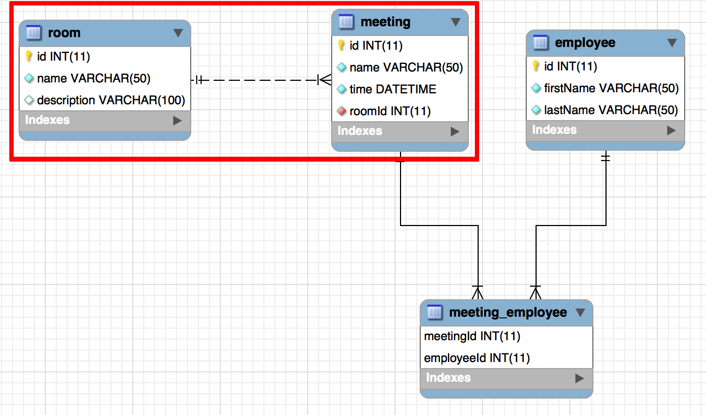
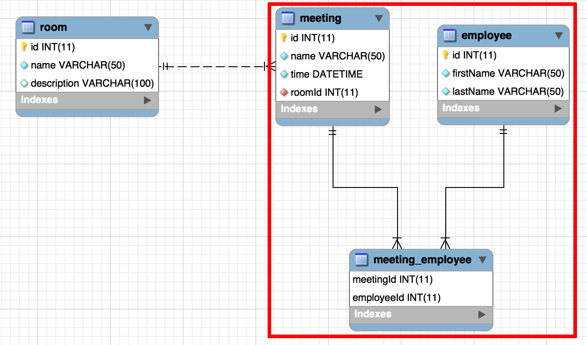

# REST Web Services

## JDBC Template and Complex Relationships

### 1. Overview

In this lesson, we will look at using JDBC Template in a tiered application and how to manage more complex relationships. So far we've only looked at single-table databases, but when we start using larger databases with one-to-many and many-to-many relationships, we have to do a lot of extra work to manage those relationships. We always want to make sure we are building and saving the complete object, including any internal objects we might be using when taking advantage of composition.

### 2. JDBC Template in a Tiered Application

In a tiered MVC application, the JDBC Template is part of the DAO in that it handles how we access and modify our data. Instead of having a DAO that saves to a file or in memory, we now have a DAO that saves and reads from the database. No other layers of our program need to change, so none of them should care where the data is coming from, just that the DAO interface methods do something.

A common pattern you will see with the DAO is that it will get broken up into separate DAOs for each different object you are working with. No longer will you have a single, massive DAO, but several smaller ones that hold only the methods for working with specific objects. 

### 3. One-To-Many Relationships

In order to represent one-to-many relationships in Java, we use composition to place an object inside another object. For example, if we have a Meeting object, there might be a Room object inside of it. The Meeting can only have a single Room but a Room can be used for many different Meetings.

The following diagram has the one-to-many relationship we are talking about highlighted:

With JDBC Template, we typically only represent relationships on one side of the relationship: in this case, a Room in a Meeting and not a List of Meetings in the Room. We do this to avoid the problem of having to fully build out each object, so a Room with a List of Meetings, each of those Meetings having a Room, that Room having a List of Meetings and so on. By having one side "manage" the relationship, we can avoid this problem. This becomes especially useful in many-to-many relationships where it's less clear which side should "manage" the relationship.

So let's start with how this looks from the perspective of the Room. Since the Room isn't "managing" the relationship, it really doesn't need to do much extra work, and the processes of getting all, getting one, adding, and updating don't need any special attention. The method that does need special attention though is delete.

When we delete from the Room side, we have to take into consideration the foreign key relationship it has with Meeting. The Meeting in this case can't have a null Room and since it is set up as a foreign key it has to be a valid existing Room. There are two options we have for how to handle it:

1. Delete any Meeting associated with the Room.
2. Update the Meeting to point to a different valid Room.

In both cases, we have to do this work before we can delete the Room itself. If we try to delete the Room before we have handled the relationship, we will get an Exception.

In this case, let's just delete any Meeting associated with the Room. To that end, we need a separate delete statement for each:

        final String DELETE_MEETING_BY_ROOM = "DELETE FROM meeting WHERE roomId = ?";
        jdbc.update(DELETE_MEETING_BY_ROOM, id);
        
        final String DELETE_ROOM = "DELETE FROM room WHERE id = ?";
        jdbc.update(DELETE_ROOM, id);

We start out by deleting any Meeting with the Room ID we want to delete and then follow up by deleting the Room itself. Now if the Meeting had any other relationships with other objects, we would also have to deal with those, but we'll look closer at that when we look at many-to-many relationships.

From the point of view of the Meeting, we do need to do a little extra work when we get all the Meetings and when we get one Meeting. When we add or update a Meeting, we just have to make sure the Room ID is part of the SQL statement, but when we delete we don't need to worry about the Room at all.

The extra work when we get all or get one Meeting is that we need to also retrieve the Room object from the database to set it in the Meeting object. We don't include the Room as part of the MeetingMapper; instead, we do a second step in the original method to get the Room for the Meeting. We add in a helper method that looks something like this:

        private Room getRoomForMeeting(Meeting meeting) {
            final String SELECT_ROOM_FOR_MEETING = "SELECT r.* FROM room r "
                    + "JOIN meeting m ON r.id = m.roomId WHERE m.id = ?";
            return jdbc.queryForObject(SELECT_ROOM_FOR_MEETING, new RoomMapper(), 
                    meeting.getId());
        }

We use a join here because the information we have to work from is the Meeting ID, but since a Meeting has a Room ID on it we can join to the Room table and get our object. When we get one Meeting, we call this directly. When we get all Meetings, we have to loop through the List of Meetings and call this for each individual Meeting. 

### 4. Many-To-Many Relationships

We use composition to represent many-to-many relationships in Java, but we put a List of one object inside of another object. As with a one-to-many relationship, we choose a side to "manage" the relationship. It's not always obvious which side should do this so we have to weigh the options. A good rule of thumb is to think about the perspective of the program and have the more important object manage the relationship.

Going back to our Meeting example, we also have Employees that attend Meetings: each Employee can go to multiple Meetings and each Meeting can have multiple Employees attending. This relationship is highlighted in the following diagram:

We have a choice here: put a List of Meetings into the Employee or put a List of Employees in the Meeting. Since the focus of this program is the Meeting itself we will go with the second option, a List of Employees in the Meeting object. The bridge table between the two tables is not directly represented in our Java code. Our JDBC Template code will have SQL queries using the bridge table, but we don't need a Java class to represent the bridge table – the List of Employees in Meeting is all we need to represent that.

Let's start with how this looks from the point of view of the Employee. As with the Room DAO in the one-to-many relationship, we only have to make changes to the delete in the Employee DAO. Specifically, we have to make sure to delete the bridge table entries for the Employee, so the delete method for the Employee DAO look like this:

        final String DELETE_MEETING_EMPLOYEE = "DELETE FROM meeting_employee "
                + "WHERE employeeId = ?";
        jdbc.update(DELETE_MEETING_EMPLOYEE, id);
        
        final String DELETE_EMPLOYEE = "DELETE FROM employee WHERE id = ?";
        jdbc.update(DELETE_EMPLOYEE, id);

We still need to delete where there are foreign key is before we can delete the Employee record. Because the bridge table has an Employee ID on it directly, we don't need to use a join here.

Before we look at the changes to the Meeting DAO to support this many-to-many relationship, we need to revisit the Room DAO. The delete in the Room DAO deletes any Meeting associated with that Room, but in this case, we have a many-to-many relationship between Meeting and Employee. This means that we must handle those relationships before we can delete any Meetings. Otherwise, the foreign key in the bridge table to Meeting will stop us from deleting the Meetings. We need to add one more SQL statement to the delete in the Room DAO:

        final String DELETE_MEETING_EMPLOYEE_BY_ROOM = "DELETE me.* FROM meeting_employee me "
                + "JOIN meeting m ON me.meetingId = m.id WHERE m.roomId = ?";
        jdbc.update(DELETE_MEETING_EMPLOYEE_BY_ROOM, id);

We are doing something here that we haven't done before: using a join inside of a SQL delete. We need the join because the meeting_employee table does not include the Room ID, we need to tell our program how to find that piece of data. Joins in deletes are completely valid. We just have to add in one new thing: an indication of which table we are deleting, which is what the "me.*" between the "DELETE" and "FROM" is doing.

Now that every CRUD method is adjusted to handle the existing relationships, we can talk about the Meeting DAO.

In the get all and get one methods, we need to add the List of Employees in the Meeting object. We will create a helper method to get Employees for a meeting:

    private List<Employee> getEmployeesForMeeting(Meeting meeting) {
        final String SELECT_EMPLOYEES_FOR_MEETING = "SELECT e.* FROM employee e "
                + "JOIN meeting_employee me ON e.id = me.employeeId WHERE me.meetingId = ?";
        return jdbc.query(SELECT_EMPLOYEES_FOR_MEETING, new EmployeeMapper(), 
                meeting.getId());
    }

We use this method by itself when we get one Meeting, but we can also use the same loop to fill in the Room when we get all Meetings.

When we create a Meeting, we must also create the entries for the meeting_employee table to register the relationship. We will create a helper method for that as well:

    private void insertMeetingEmployee(Meeting meeting) {
        final String INSERT_MEETING_EMPLOYEE = "INSERT INTO meeting_employee"
                + "(meetingId, employeeId) VALUES(?,?)";
        for(Employee employee : meeting.getAttendees()) {
            jdbc.update(INSERT_MEETING_EMPLOYEE, meeting.getId(), employee.getId());
        }
    }

Updating a Meeting will use this method as well, but we need to first delete all the meeting_employee table entries:

        final String DELETE_MEETING_EMPLOYEE = "DELETE FROM meeting_employee "
                + "WHERE meetingId = ?";
        jdbc.update(DELETE_MEETING_EMPLOYEE, meeting.getId());
        insertMeetingEmployee(meeting);

With many-to-many relationships in a relatively small database, deleting all the relationships and recreating them ends up being a lot easier than analyzing the changes and writing queries to process only the additions or deletions from the relationship. If the set of relationships is significantly large, however, it might make more sense to identify and modify only the values that need to change.

Deleting the Meeting just needs to delete the bridge table entries before it deletes itself, to make sure the foreign key relationship is dealt with before anything else. This is how that looks:

        final String DELETE_MEETING_EMPLOYEE = "DELETE FROM meeting_employee "
                + "WHERE meetingId = ?";
        jdbc.update(DELETE_MEETING_EMPLOYEE, id);
        
        final String DELETE_MEETING = "DELETE FROM meeting WHERE id = ?";
        jdbc.update(DELETE_MEETING, id);

### 5. Implementation

Download the starter project here: JDBCTComplexExampleStarter.zip (Please note that this starter project will not build correctly until this section's code-along has been completed.)

We are going to implement the DAOs for the Meeting Manager project that were used as examples above. This program lets us create and manage meetings, set them in specific rooms, and identify who will be attending the meeting. It also allows us to see some extra info, like what meetings are scheduled for a particular room and what meetings a specific employee is scheduled to attend. All of this will show how you can represent the different types of relationships using JDBC Template. When we move to the web, the DAO and JDBC Template aspect of the projects will continue to look just like this.

To start with, we will need the database we are going to use. Here is the script with some sample data inserted to help us verify our code is working:

DROP DATABASE IF EXISTS meetingDB;
CREATE DATABASE meetingDB;

USE meetingDB;

CREATE TABLE room(
id INT PRIMARY KEY AUTO_INCREMENT,
`name` VARCHAR(50) NOT NULL,
`description` VARCHAR(100)
);

CREATE TABLE meeting(
id INT PRIMARY KEY AUTO_INCREMENT,
`name` VARCHAR(50) NOT NULL,
`time` DATETIME NOT NULL,
roomId INT NOT NULL,
FOREIGN KEY (roomId) REFERENCES room(id));

CREATE TABLE employee(
id INT PRIMARY KEY AUTO_INCREMENT,
firstName VARCHAR(50) NOT NULL,
lastName VARCHAR(50) NOT NULL);

CREATE TABLE meeting_employee(
meetingId INT NOT NULL,
employeeId INT NOT NULL,
PRIMARY KEY(meetingId, employeeId),
FOREIGN KEY (meetingId) REFERENCES meeting(id),
FOREIGN KEY (employeeId) REFERENCES employee(id));

INSERT INTO room(id, name, description) VALUES(1, "North Room", "Large conference room");
INSERT INTO room(id, name, description) VALUES(2, "South Room", "Medium conference room");
INSERT INTO room(id, name, description) VALUES(3, "West Room", "Small conference room");

INSERT INTO meeting(id, name, time, roomId) VALUES(1, "All Team Meeting", '2018-01-01 14:00:00', 1);
INSERT INTO meeting(id, name, time, roomId) VALUES(2, "Lunch and Learn", '2018-01-02 12:00:00', 1);
INSERT INTO meeting(id, name, time, roomId) VALUES(3, "Birthday", '2018-01-03 10:00:00', 2);

INSERT INTO employee(id, firstName, lastName) VALUES(1, "Bob", "Johnson");
INSERT INTO employee(id, firstName, lastName) VALUES(2, "John", "Smith");
INSERT INTO employee(id, firstName, lastName) VALUES(3, "Karen", "Jones");
INSERT INTO employee(id, firstName, lastName) VALUES(4, "Connie", "Samson");

INSERT INTO meeting_employee(meetingId, employeeId) VALUES(1, 1);
INSERT INTO meeting_employee(meetingId, employeeId) VALUES(1, 2);
INSERT INTO meeting_employee(meetingId, employeeId) VALUES(1, 3);
INSERT INTO meeting_employee(meetingId, employeeId) VALUES(1, 4);
INSERT INTO meeting_employee(meetingId, employeeId) VALUES(2, 3);
INSERT INTO meeting_employee(meetingId, employeeId) VALUES(2, 4);
INSERT INTO meeting_employee(meetingId, employeeId) VALUES(3, 1);
INSERT INTO meeting_employee(meetingId, employeeId) VALUES(3, 2);
INSERT INTO meeting_employee(meetingId, employeeId) VALUES(3, 4);

Once we have the database in place, we can start coding. The project has the correct dependencies already in place in the pom.xml as well as the application.properties set up for us to connect to the database. The Controller and View classes are all written as are the DAO interfaces, so we only have to implement the DAOs to make it work. Take a look through the existing code to get an idea of how it all works; it should look fairly similar to projects you have already done.

Let's start our coding with the Room DAO.
Room DAO

Our Room DAO interface has the five basic CRUD methods in it. Start by creating a new class called RoomDAODB that implements our RoomDAO. Since we are going to use annotation-based dependency injection, we need to annotate this class as a @Repository. The first couple of lines in your class should look like this:

@Repository
public class RoomDaoDB implements RoomDao {

Before we can start fully implementing any of the overridden methods, we have to do two things. First we need to autowire the JdbcTemplate in:

    @Autowired
    JdbcTemplate jdbc;

Second, we need to add in the RoomMapper so we can turn the database data into a Room object:

    public static final class RoomMapper implements RowMapper<Room> {

        @Override
        public Room mapRow(ResultSet rs, int index) throws SQLException {
            Room rm = new Room();
            rm.setId(rs.getInt("id"));
            rm.setName(rs.getString("name"));
            rm.setDescription(rs.getString("description"));
            return rm;
        }
    }

You might notice we have made this mapper public instead of private like our previous mappers were. That is so we can access this mapper to add a Room object to the Meeting objects when we implement the Meeting DAO.

With those two pieces in place, we can start writing code for our overridden methods. Let's start with "getAllRooms":

    @Override
    public List<Room> getAllRooms() {
        final String SELECT_ALL_ROOMS = "SELECT * FROM room";
        return jdbc.query(SELECT_ALL_ROOMS, new RoomMapper());
    }

    We start by declaring our query as a String.
    We then return the results of our "query" method call with the query String and RoomMapper as parameters.

That one is pretty simple; "getRoomById" is equally pretty straightforward:

    @Override
    public Room getRoomById(int id) {
        try {
            final String SELECT_ROOM_BY_ID = "SELECT * FROM room WHERE id = ?";
            return jdbc.queryForObject(SELECT_ROOM_BY_ID, new RoomMapper(), id);
        } catch(DataAccessException ex) {
            return null;
        }
    }

    We have our query String and our call to "queryForObject" with the additional parameter of the ID.
    We are also surrounding the call in a try-catch since "queryForObject" will throw an Exception if no object is returned from the query.
    We return null in the catch so that we have an indicator that we could not retrieve the object.

Next, we will look at "addRoom". This method is set up to return a Room object, the idea being that the Room we pass in does not have an ID and the one returned will have the ID that the database assigns it. Because of this, we will see a new annotation here, @Transactional:

    @Override
    @Transactional
    public Room addRoom(Room room) {
        final String INSERT_ROOM = "INSERT INTO room(name, description) VALUES(?,?)";
        jdbc.update(INSERT_ROOM, 
                room.getName(), 
                room.getDescription());
        
        int newId = jdbc.queryForObject("SELECT LAST_INSERT_ID()", Integer.class);
        room.setId(newId);
        return room;
    }

    The @Transactional annotation means every query run against the database in this method is part of a single transaction, so if any of the queries fail, the program will roll back all of them. It also means they all run together with no other queries getting in the way, which is what we are taking advantage of to get the assigned ID out.
    We have to create our query String and use the "update" method to run it with the necessary data.
    After running the query, we need to run a special query to get the ID from the database. LAST_INSERT_ID() is a function built into MySQL that returns the ID of the most recent row inserted into the database. By including the query as part of the transaction, the INSERT the transaction performs is the one we will get the ID for.
    We can now put that ID into the Room object and return Room.

The "updateRoom" method is a lot more straightforward; we don't need to do anything special for it:

    @Override
    public void updateRoom(Room room) {
        final String UPDATE_ROOM = "UPDATE room SET name = ?, description = ? WHERE id = ?";
        jdbc.update(UPDATE_ROOM,
                room.getName(),
                room.getDescription(),
                room.getId());
    }

    We simply define our UPDATE query and then use the "update" method to send it to the database with the necessary data.

Finally, we have our "deleteRoomById" method that we discussed earlier:

    @Override
    @Transactional
    public void deleteRoomById(int id) {
        final String DELETE_MEETING_EMPLOYEE_BY_ROOM = "DELETE me.* FROM meeting_employee me "
                + "JOIN meeting m ON me.meetingId = m.id WHERE m.roomId = ?";
        jdbc.update(DELETE_MEETING_EMPLOYEE_BY_ROOM, id);
        
        final String DELETE_MEETING_BY_ROOM = "DELETE FROM meeting WHERE roomId = ?";
        jdbc.update(DELETE_MEETING_BY_ROOM, id);
        
        final String DELETE_ROOM = "DELETE FROM room WHERE id = ?";
        jdbc.update(DELETE_ROOM, id);
    }

    We use @Transactional here as well, but this time it's because we are making multiple modifications to the database in a single method, and we want all modifications to succeed or fail together.
    We have to do this multiple-tier delete because of foreign key relationships, starting with the 'meeting_employee' table, moving then to the 'meeting' table, and then finally deleting from the 'room' table.
    Remember that the order is very important for these deletes.

With that, the Room DAO implementation is now complete. You should be able to run the program and list, add, update, and delete Rooms.

You'll notice in the Room menu there is an option to "View Meetings for Room" that does not yet work. Since that returns a list of Meetings, its implementation is tied to the Meeting DAO and will be completed later in the code-along.

Now let's look at the Employee DAO.
Employee DAO

The Employee DAO is much like the Room DAO, but because it isn't "managing" the relationship to the Meeting, it doesn't need to really consider it except for the delete.

We'll start out by creating the EmployeeDaoDB class, having it implement the EmployeeDAO and be annotated as a @Repository:

@Repository
public class EmployeeDaoDB implements EmployeeDao {

Next, before we implement all our methods, we add in the JdbcTemplate:

    @Autowired
    JdbcTemplate jdbc;

As well as add in our EmployeeMapper:

    public static final class EmployeeMapper implements RowMapper<Employee> {

        @Override
        public Employee mapRow(ResultSet rs, int index) throws SQLException {
            Employee emp = new Employee();
            emp.setId(rs.getInt("id"));
            emp.setFirstName(rs.getString("firstName"));
            emp.setLastName(rs.getString("lastName"));
            return emp;
        }
    }

This one is also public so it can be accessed by the Meeting DAO later when we want to add the List of Employees to the Meeting.

Now we can start with "getAllEmployees":

    @Override
    public List<Employee> getAllEmployees() {
        final String SELECT_ALL_EMPLOYEES = "SELECT * FROM employee";
        return jdbc.query(SELECT_ALL_EMPLOYEES, new EmployeeMapper());
    }

    We start by creating our query String.
    We then call the "query" method with the query String and the EmployeeMapper to create our List of Employee objects.

With that in place we can move on to "getEmployeeById":

    @Override
    public Employee getEmployeeById(int id) {
        try {
            final String SELECT_EMPLOYEE_BY_ID = "SELECT * FROM employee WHERE id = ?";
            return jdbc.queryForObject(SELECT_EMPLOYEE_BY_ID, new EmployeeMapper(), id);
        } catch(DataAccessException ex) {
            return null;
        }
    }  

    We wrap it all in a try-catch again since "queryForObject" throws an Exception if nothing is found from the query.
    We create our query String and use it in the "queryForObject" method with the EmployeeMapper and id parameter for the query.
    If an exception is thrown, we return null to indicate that Employee was not found in the database.

We can now look at "addEmployee". As with "addRoom", we use @Transactional here to help us retrieve the ID of the Employee after adding it to the database:

    @Override
    @Transactional
    public Employee addEmployee(Employee employee) {
        final String INSERT_EMPLOYEE = "INSERT INTO employee(firstName, lastName) "
                + "VALUES(?,?)";
        jdbc.update(INSERT_EMPLOYEE, 
                employee.getFirstName(),
                employee.getLastName());
        int newId = jdbc.queryForObject("SELECT LAST_INSERT_ID()", Integer.class);
        employee.setId(newId);
        return employee;
    }

    We start with @Transactional so we can be sure all the queries in this method run in a single transaction.
    We create our INSERT String and use it with the appropriate data in the "update" method.
    We then use a query with LAST_INSERT_ID() to get the ID of the Employee that was just inserted in the database.
    We put the ID into the Employee object and return it.

Next, we move on to the "updateEmployee" method:

    @Override
    public void updateEmployee(Employee employee) {
        final String UPDATE_EMPLOYEE = "UPDATE employee SET firstName = ?, lastName = ? "
                + "WHERE id = ?";
        jdbc.update(UPDATE_EMPLOYEE,
                employee.getFirstName(),
                employee.getLastName(),
                employee.getId());
    }

    We create the UPDATE String for the employee data and then use it with the appropriate data in the same order in the "update" method call.

Lastly, we go to the "deleteEmployeeById" method, where we have to consider the relationship with Meeting:

    @Override
    @Transactional
    public void deleteEmployeeById(int id) {
        final String DELETE_MEETING_EMPLOYEE = "DELETE FROM meeting_employee "
                + "WHERE employeeId = ?";
        jdbc.update(DELETE_MEETING_EMPLOYEE, id);
        
        final String DELETE_EMPLOYEE = "DELETE FROM employee WHERE id = ?";
        jdbc.update(DELETE_EMPLOYEE, id);
    }

    We start with @Transactional because we are making multiple database calls to perform the deletion.
    We start by deleting the bridge table entries between Employee and Meeting.
    We follow up by deleting the Employee entry itself.

That is all we need to do for the Employee DAO. The Employee section of the program should now, with the exception of View Meetings for Employee that we will touch on in the next section.

Lastly, we have the Meeting DAO to implement.
Meeting DAO

The Meeting DAO is the most complicated of the three DAOs because it handles both the relationship with Room and the relationship with Employee. We will see that this relationship touches every single method in the DAO. Before we get to that though we have to set up the class itself.

Start by creating the MeetingDaoDB class, make it implement the MeetingDao, and annotate it as a @Repository:

@Repository
public class MeetingDaoDB implements MeetingDao {

Next, we autowire in the JdbcTemplate:

    @Autowired
    JdbcTemplate jdbc;

Then we create our MeetingMapper:

    public static final class MeetingMapper implements RowMapper<Meeting> {

        @Override
        public Meeting mapRow(ResultSet rs, int index) throws SQLException {
            Meeting meet = new Meeting();
            meet.setId(rs.getInt("id"));
            meet.setName(rs.getString("name"));
            meet.setTime(rs.getTimestamp("time").toLocalDateTime());
            return meet;
        }
    }

The MeetingMapper in this case could be private, but to keep things consistent with the other mappers, we'll leave it public. Note also that in order to bring in the DATETIME field "time" from the database, we bring it in as a Timestamp and convert it to a LocalDateTime. You would something similar with a DATE field and LocalDate.

Now that we have these in place, we can start with our overridden methods. Rather than starting with "getAllMeetings" though, we'll start this time with "getMeetingById":

    @Override
    public Meeting getMeetingByid(int id) {
        try {
            final String SELECT_MEETING_BY_ID = "SELECT * FROM meeting WHERE id = ?";
            Meeting meeting = jdbc.queryForObject(SELECT_MEETING_BY_ID, 
                    new MeetingMapper(), id);
            meeting.setRoom(getRoomForMeeting(meeting));
            meeting.setAttendees(getEmployeesForMeeting(meeting));
            return meeting;
        } catch(DataAccessException ex) {
            return null;
        }
    }

    Like our other get by ID methods, we wrap it in a try-catch in case queryForObject does not find our Meeting.
    We start out like the others, creating the query String and calling it with "queryForObject" with our mapper and ID parameter, but this time we save it into a variable so we can add in our other objects.
    We then get the room using a helper method, "getRoomForMeeting".
    Next, we get the attendees – our List of Employees – using another helper method, "getEmployeesForMeeting".
    We then return the Meeting object.
    If we can't find the Meeting object, we return null.

We use two helper methods in this method. Let's create those now, starting with "getRoomForMeeting":

    private Room getRoomForMeeting(Meeting meeting) {
        final String SELECT_ROOM_FOR_MEETING = "SELECT r.* FROM room r "
                + "JOIN meeting m ON r.id = m.roomId WHERE m.id = ?";
        return jdbc.queryForObject(SELECT_ROOM_FOR_MEETING, new RoomMapper(), 
                meeting.getId());
    }

    Since it is a helper method, it is left private. No other class will ever be using this method.
    We pass in the Meeting object we want the room for so we can access its ID.
    We create our query String, joining from room to meeting so we can get the Room object.
    We use "queryForObject" to make the query, using the RoomMapper and Meeting ID to complete the call.
    We aren't using a try-catch here because our database definition should guarantee our Meeting has a valid Room in it; we should never see an Exception thrown here.

Now let's look at "getEmployeesForMeeting":

    private List<Employee> getEmployeesForMeeting(Meeting meeting) {
        final String SELECT_EMPLOYEES_FOR_MEETING = "SELECT e.* FROM employee e "
                + "JOIN meeting_employee me ON e.id = me.employeeId WHERE me.meetingId = ?";
        return jdbc.query(SELECT_EMPLOYEES_FOR_MEETING, new EmployeeMapper(), 
                meeting.getId());
    }

    Once again this method is private because it is a helper method that other classes should not be able to see.
    We pass in the Meeting object again so we can get its ID.
    We create our query String, joining from meeting_employee to employee so we can get all the Employee objects we need.
    We use the "query" method to call our query, passing in the EmployeeMapper and Meeting ID.

We will see these helper methods used again when we look at "getAllMeetings", which adds its own helper method around them to work more efficiently and be reusable for later methods.

Here is what "getAllMeetings" looks like:

    @Override
    public List<Meeting> getAllMeetings() {
        final String SELECT_ALL_MEETINGS = "SELECT * FROM meeting";
        List<Meeting> meetings = jdbc.query(SELECT_ALL_MEETINGS, new MeetingMapper());
        
        addRoomAndEmployeesToMeetings(meetings);
        
        return meetings;
    }

    We start by creating our query String and using it with the "query" method and the MeetingMapper to get a List of Meetings that we save into a variable instead of directly returning them.
    Next, we call the helper method "addRoomAndEmployeesToMeetings" and pass in our List of Meetings. In that method, each Meeting will have the Room and List of Employees added to it.
    Once we do that we can return our List of Meetings.

The difference here from previous get all methods is the helper method. Let's create the "addRoomAndEmployeesToMeetings" method:

    private void addRoomAndEmployeesToMeetings(List<Meeting> meetings) {
        for(Meeting meeting : meetings) {
            meeting.setRoom(getRoomForMeeting(meeting));
            meeting.setAttendees(getEmployeesForMeeting(meeting));
        }
    }

    Just like the previous helper methods, this one is private.
    We pass in the List of Meetings we want to work against.
    We use an enhanced for loop so we can loop over each Meeting.
    Inside the loop, we call our two pre-existing helper methods to get the Room and List of Employees for each individual Meeting we look at.

When this method finishes, all the Meetings in the List should be fully filled out with Rooms and Employees. We make this one its own method so we can use it later with "getMeetingsForRoom" and "getMeetingsForEmployee". Let's look at those two methods.

First, "getMeetingsForRoom":

    @Override
    public List<Meeting> getMeetingsForRoom(Room room) {
        final String SELECT_MEETINGS_FOR_ROOM = "SELECT * FROM meeting WHERE roomId = ?";
        List<Meeting> meetings = jdbc.query(SELECT_MEETINGS_FOR_ROOM, 
                new MeetingMapper(), room.getId());
        
        addRoomAndEmployeesToMeetings(meetings);
        
        return meetings;
    }

    Since meeting has roomId in it, we can easily have our query String just work on the meeting table.
    We get our List of Meetings from the "query" method with our query, using MeetingMapper and Room ID as parameters.
    We then use our "addRoomAndEmployeesToMeetings" helper method to finish filling in each Meeting before we return the List.

Now, "getMeetingsForEmployee":

    @Override
    public List<Meeting> getMeetingsForEmployee(Employee employee) {
        final String SELECT_MEETINGS_FOR_EMPLOYEE = "SELECT * FROM meeting m "
                + "JOIN meeting_employee me ON m.id = me.meetingId WHERE me.employeeId = ?";
        List<Meeting> meetings = jdbc.query(SELECT_MEETINGS_FOR_EMPLOYEE, 
                new MeetingMapper(), employee.getId());
        
        addRoomAndEmployeesToMeetings(meetings);
        
        return meetings;
    }

    We have to join from meeting_employee to meeting in order to get the Meeting objects for an Employee.
    We get our List of Meetings from the "query" method with our query, using MeetingMapper and Employee ID as parameters.
    We then use our "addRoomAndEmployeesToMeetings" helper method to finish filling in each Meeting before we return the List.

Those are all of our methods that get a Meeting or Meetings. Now let's look at the methods that modify the Meeting table, starting with "addMeeting":

    @Override
    @Transactional
    public Meeting addMeeting(Meeting meeting) {
        final String INSERT_MEETING = "INSERT INTO meeting(name, time, roomId) VALUES(?,?,?)";
        jdbc.update(INSERT_MEETING,
                meeting.getName(),
                Timestamp.valueOf(meeting.getTime()),
                meeting.getRoom().getId());
        int newId = jdbc.queryForObject("SELECT LAST_INSERT_ID()", Integer.class);
        meeting.setId(newId);
        
        insertMeetingEmployee(meeting);
        
        return meeting;
    }

    Like our other add methods, we make this one @Transactional to guarantee we get the correct ID out of the database.
    We start with an INSERT String.
    We use that INSERT String in an "update" method with the appropriate data.
    Of note in the "update" is how we handle passing the LocalDateTime field into the database: we have to wrap it in "Timestamp.valueOf" so that it looks correct when we write it to the database.
    We query LAST_INSERT_ID() to find the ID for the Meeting and put it into the Meeting itself.
    Once the ID is in the Meeting, we can call our new helper method "insertMeetingEmployee" which will handle creating the bridge table entries for the Meeting/Employee relationship.
    Finally, we return our Meeting object.

The "insertMeetingEmployee" method is the new helper method here. We use it to insert new entries into the meeting_employee bridge table to save the relationship between the Meeting and any Employee attending the meeting. Here is the method we need to create:

    private void insertMeetingEmployee(Meeting meeting) {
        final String INSERT_MEETING_EMPLOYEE = "INSERT INTO meeting_employee"
                + "(meetingId, employeeId) VALUES(?,?)";
        for(Employee employee : meeting.getAttendees()) {
            jdbc.update(INSERT_MEETING_EMPLOYEE, meeting.getId(), employee.getId());
        }
    }
A

    As a helper method, it is private to start with and we pass in the Meeting we want to create entries for.
    We can create our query String before the loop because it never actually changes; only the data we put into it changes.
    We then start looping over the List of Employees in the Meeting object.
    For each employee, we run the "update" method with the query String, our Meeting ID, and the Employee ID from the loop.

The add with the insert of the bridge table entries will preserve the Meeting with all of its attendees.

Next, let's look at "updateMeeting" where we will need to use our "insertMeetingEmployee" helper method as well:

    @Override
    @Transactional
    public void updateMeeting(Meeting meeting) {
        final String UPDATE_MEETING = "UPDATE meeting "
                + "SET name = ?, time = ?, roomId = ? WHERE id = ?";
        jdbc.update(UPDATE_MEETING,
                meeting.getName(),
                Timestamp.valueOf(meeting.getTime()),
                meeting.getRoom().getId(),
                meeting.getId());
        
        final String DELETE_MEETING_EMPLOYEE = "DELETE FROM meeting_employee "
                + "WHERE meetingId = ?";
        jdbc.update(DELETE_MEETING_EMPLOYEE, meeting.getId());
        insertMeetingEmployee(meeting);
    }

* An immediate difference from our previous updates, this one is @Transactional because we are making multiple calls to the database that will modify it.
* We then create an UPDATE String for the Meeting fields and use it in the "update" method with the appropriate data.
* We handle the LocalDateTime the same way we did in the add method, by wrapping it in "Timestamp.valueOf".
* After the "update" call, we need to handle the relationship with Employee so we start by deleting all the existing bridge table entries for the relationship.
* We follow up by calling our "insertMeetingEmployee" helper method to reinsert the Employees that are now associated with this Meeting.

As mentioned earlier, the process of deleting the relationship and recreating it in the update method is an easy way to handle updating the relationship information. We could approach this by analyzing the List of Employees in the Meeting object versus what is in the database and add and delete only those necessary, but in this case, the extra work that process would create would not be paid off with increased efficiency.

We finally come to the "deleteMeetingById" method which looks similar to our other deletes:

    @Override
    public void deleteMeetingById(int id) {
        final String DELETE_MEETING_EMPLOYEE = "DELETE FROM meeting_employee "
                + "WHERE meetingId = ?";
        jdbc.update(DELETE_MEETING_EMPLOYEE, id);
        
        final String DELETE_MEETING = "DELETE FROM meeting WHERE id = ?";
        jdbc.update(DELETE_MEETING, id);
    }

    We must first handle the foreign key relationship in meeting_employee and delete those entries.
    Once those are handled we can delete the Meeting itself.

With the Meeting DAO now complete you should be able to run all aspects of the Meeting Manager program. 