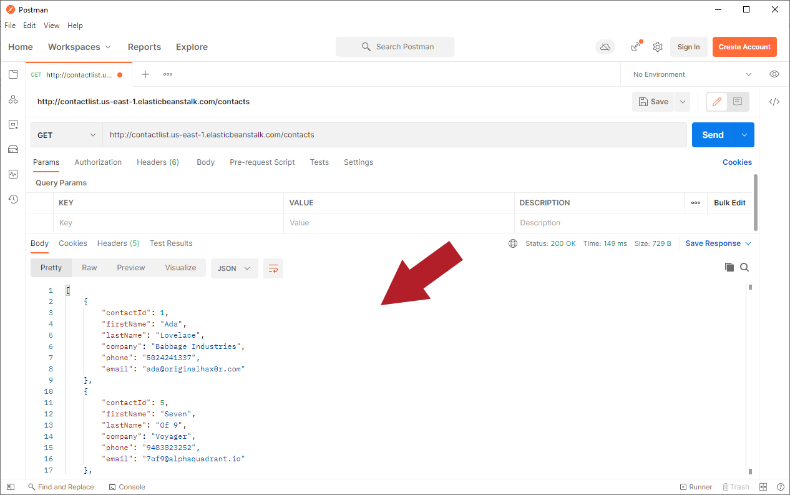
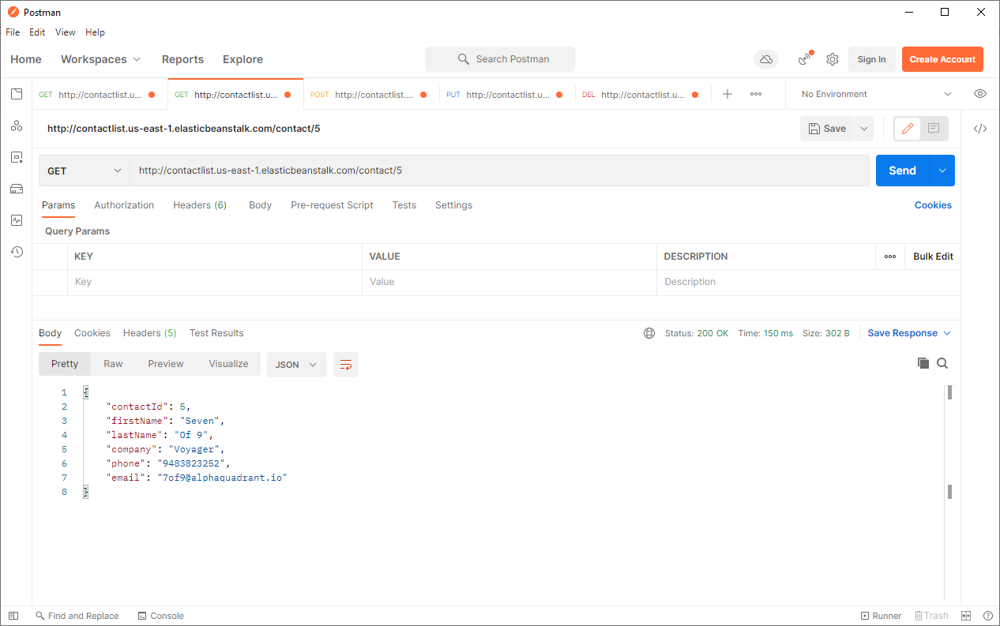
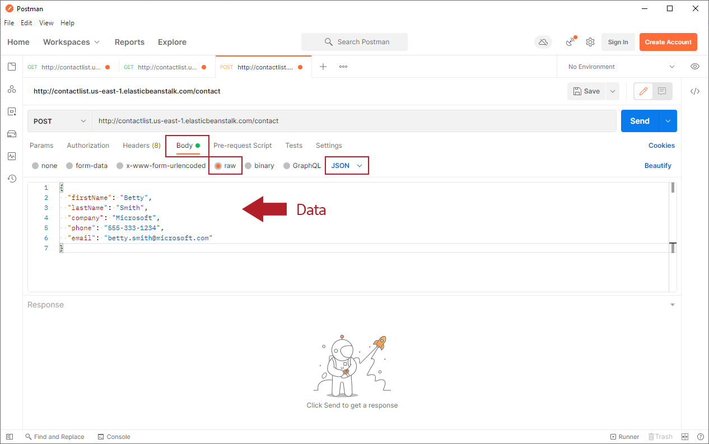
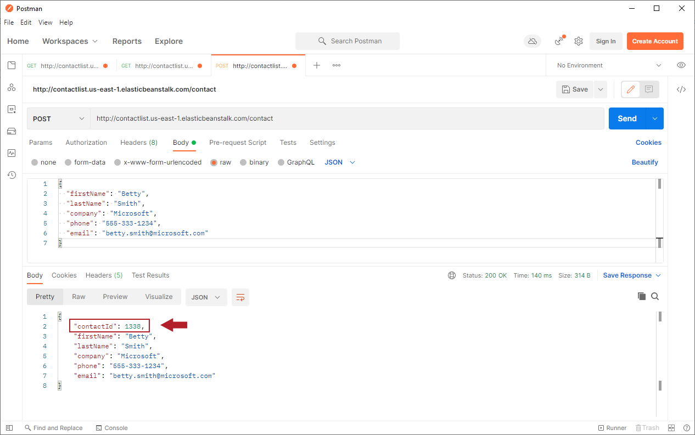
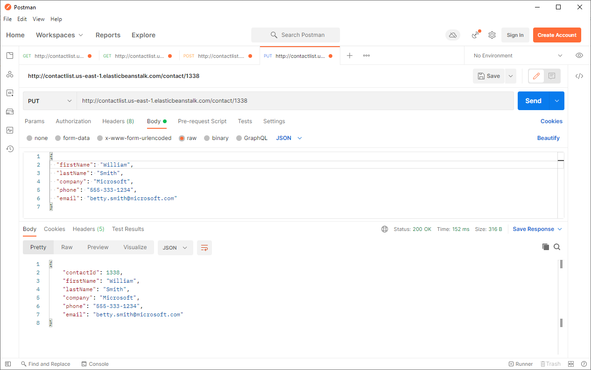
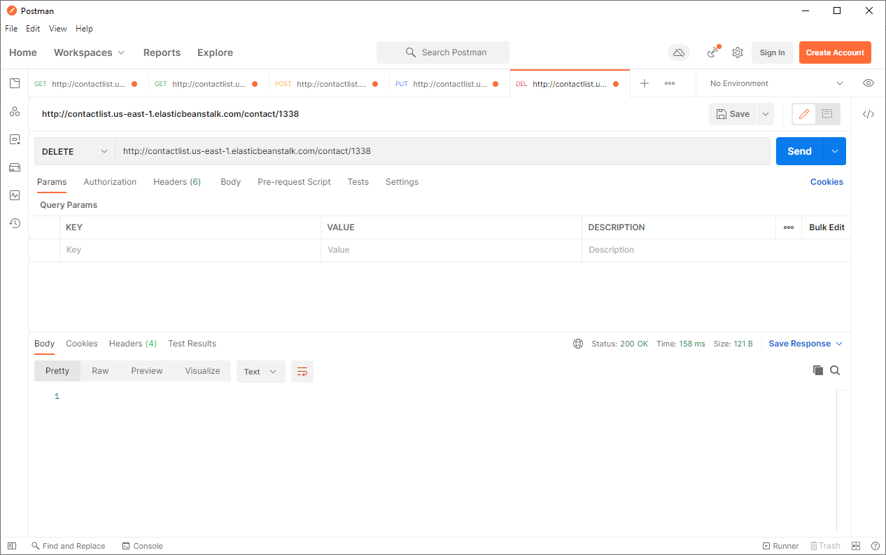

# Working With Postman

### Overview

In this exercise, you will use Postman to experiment with a Contact List API to better understand how REST works with HTTP requests.

Before starting this activity, verify that the following URL works to open a page with a welcome message:

* http://contactlist.us-east-1.elasticbeanstalk.com/

If this link does not work, contact your instructor about the problem before starting the exercise.
In the steps that follow, use Postman to test the REST endpoints in the URL as described in each step. For each test, record the results of the test, including the following information:

* The status response
* A summary of the contents of the response body

> Disclaimer  
This is a live API that multiple people can use at the same time. Because the API allows users to add new records and edit existing records, your results will depend on the data in the dataset at the time you run each request and will likely be different from what is shown in the screenshots here.  
Use the screenshots as a guide, rather than expecting your results to exactly match what is shown here.  
When editing or deleting existing records, please modify only records you have created, so you are less likely to interfere with records that someone else may be using.

### 1. Get All

We'll start with a simple test that retrieves all contacts in the contact list.

Here's the endpoint:

        HTTP Method: GET
        URL: http://contactlist.us-east-1.elasticbeanstalk.com/contacts
        Request Body: None
        Response Body: JSON array of all the contacts from the service

Open a tab in Postman and set up a GET request with the URL shown above.  
Run the request and you should see something like:

> ⚠ Important Note ⚠  
Remember that your results may be different from what is shown here! You will likely see a different set of records, depending on the current state of the API.

The two main items to notice are the Response Body (on the Body tab in the Response pane) and the Status.

* The response includes all records currently in the dataset, although you may see only a couple of records without scrolling.
* The data is formatted in JSON, a human-friendly data format that uses key:value pairs to identify fields and their corresponding values.
* The status represents the status of the HTTP request. The status 200 OK represents a successful request. If you get a different status number, check your settings and try again.

> See the MDN web docs page, HTTP response status codes, for more details about status codes.

### 2. Get One

Now retrieve a single contact of your choice. Each of the contacts in the response from the previous request includes a unique ID value. Use that ID value to retrieve only that contact.

Here's the endpoint:

        HTTP Method: GET
        URL: http://contactlist.us-east-1.elasticbeanstalk.com/contact/[id]
        Request Body: None
        Response Body: JSON array of the data corresponding to the submitted id number

For example, if you want to retrieve the record for Seven of 9 shown in the first screenshot, you would use the id number 5: http://contactlist.us-east-1.elasticbeanstalk.com/contact/5. The results will show only that record:

> If your results do not include this record, try the GET ONE request using an ID value from the data retrieved in the GET ALL request earlier.

### 3. Create One

We can use the POST request to create a new contact in the contact list.

The endpoint is:

        HTTP Method: POST
        URL: http://contactlist.us-east-1.elasticbeanstalk.com/contact
        Request Body: JSON string containing the Contact data
        Response Body: JSON string containing all of the original Contact data plus the contactId value that the web service assigned to the newly created Contact

This is more complicated than earlier requests because we now have to send data with the request.

Set up the request in Postman using POST and the URL shown in the endpoint. Change the following items before clicking the Send button.

1. Click the Body tab under the address bar.
2. Click the Raw option and select JSON in the drop-down menu on the far right edge of the same toolbar.
3. Enter the new data in the format:

        {
            "firstName": "Betty",
            "lastName": "Smith",
            "company": "Microsoft",
            "phone": "555-333-1234",
            "email": "betty.smith@microsoft.com"
        }

> This example uses the data shown above. We recommend that you use a different name so that you can easily recognize the record in later steps, but keep in mind that others using the API may see what you send.
Postman window with the settings described above.

Once everything looks good, click Send and record the results. Note in particular the id number that the API assigns to the new contact.

The contactId value is automatically assigned to each new record, and each record will have a unique contactId. This means that your new record will have a different contactId than the one shown here. Make note of the contactId assigned to the new record so that you can use it in the next steps.

#### 3.1. Retrieve the New Contact

Use the Get One settings described earlier to retrieve the new contact and check that it looks okay.

### 4. Update a Contact

Now use a PUT request to change the contact you just created. Here is the endpoint to update a record:

      HTTP Method: PUT
      URL: http://contactlist.us-east-1.elasticbeanstalk.com/contact/[id]
      Request Body: JSON string containing the Contact data
      Response Body: None

This is very similar to the POST request used to create the contact, except that now you have the contact id.

A PUT request replaces all fields of the selected record, so the JSON request data should include a value for all fields except the id, even those that will not be changed.

Use the same Raw/JSON settings in the Body tab and add the complete record for your new contact with at least one of the values changed. In our example, we can change the first name to William:

When you submit this request, you should see the updated record in the results.

### 5. Delete a Contact

Finally, delete the contact you created.
      
      HTTP Method: DELETE
      URL: http://contactlist.us-east-1.elasticbeanstalk.com/contact/[id]
      Request Body: None
      Response Body: None

This endpoint takes as input a path variable (contactId) that specifies the contact to be deleted.

*  Note that the URL is identical to the URL for retrieving a contact but it uses the DELETE method instead of GET.
*  This endpoint returns no data. If the specified contact does not exist, the web service takes no action.

For the record we created earlier, this looks like:

After running this request (and getting a 200 status back) using the contactId for the record you created, run your original GET ALL request to verify that the record was deleted.

> Try running the DELETE and GET ONE requests again for the deleted record. What are the results?
