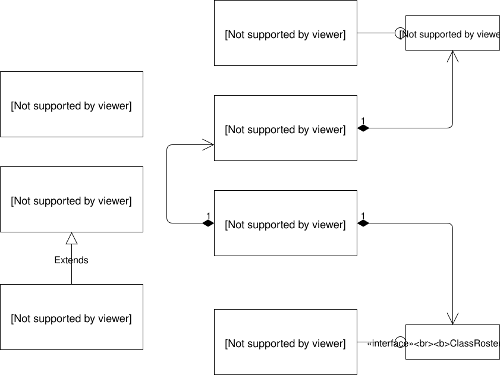

# Class Roster: Code Along

This lesson is the first in a series that form a code-along of an entire console application that puts everything that you've learned so far in the course into practice.  
The purpose of this code-along is to give you an example of how to design and build a console-based MVC CRUD application using all the tools and techniques you have learned so far.  
You should use this document as a template for the Address Book and DVD Library labs. We'll build this project following the Agile checklist and will organize it using tiered application design and MVC patterns demonstrated in this section.

## 1. Application Requirements and Use Cases

We will build an application that manages a roster of students. The user will be able to create, view, and delete students in the system and all student data will be persisted to a file. Here are the use cases:

- Add Student 
- View All Students 
- View a Single Student 
- Remove Student

Further, there is a requirement that the application store all of the student data in a file so that student data persists between times the Student Roster application is run.

## 2. Application Structure

Figure 1 is the UML class diagram of the Class Roster application. We've seen UML diagrams of stand-alone classes in the class modeling lesson of this section. Here we introduce notation that represents interface, composition, and inheritance relationships.

## 3. Interface Relationships

The lines ending in circles show that a class implements a particular interface.  
For example, `ClassRosterDaoFileImpl` implements the `ClassRosterDao` interface in the above diagram. Our convention is to name the interface for the logical component that it represents — in this case, the `ClassRosterDao`. Each class that implements the interface will be named for the type of implementation that the class represents and always ends in Impl (for implementation). Here, our DAO is implemented using text files so it is called `ClassRosterDaoFileImpl`. If we had an implementation that used a database instead, it might be called `ClassRosterDaoDatabaseImpl`.

## 4. Composition Relationships

The lines that end in diamonds represent composition. For example, `ClassRosterController` has a member that is a `ClassRosterDao` and a member that is a `ClassRosterView`. `ClassRosterView` has a member of type `UserIO`.

## 5. Inheritance Relationships

The line ending in the arrowhead represents inheritance. Here, our `ClassRosterDaoException` extends `Exception`.

Keep this diagram in mind as we build the application — we'll see all of the implementation details as we go.

## 6. Classes and Interfaces in Our Application

The Class Roster application will have six classes:

- Student 
  - This is the data transfer object (DTO) that holds all the Student info.
- UserIOConsoleImpl 
  - This is the console-specific implementation of the UserIO interface. 
- ClassRosterView 
  - This class handles all the UI logic. 
- ClassRosterController 
  - This is the orchestrator of the application. It knows what needs to be done, when it needs to be done, and what component can do the job. 
- ClassRosterDaoFileImpl 
  - This is the text file-specific implementation of the ClassRosterDao interface. 
  - Data access object (DAO)
- ClassRosterDaoException 
  - This is the error class for our application. It extends Exception.

The application will also have two interfaces:

- ClassRosterDao 
  - This interface defines the methods that must be implemented by any class that wants to play the role of data access object (DAO) in the application. We will implement a text file-based data access object (DAO) in the code-along. You could imagine, however, an implementation that only stored student data in memory or one that stored student data in a database. Each class would be different but all would implement that same interface, ensuring that they are all well encapsulated. Note that the ClassRosterController only uses this interface to reference the data access object (DAO) — it is completely unaware of the implementation details.
- UserIO 
  - This interface defines the methods that must be implemented by any class that wants to directly interact with the user interface technology. We will implement a console-based user interface in the code-along. You could image, however, an implementation that used a windowing system or some other technology. Again, each class would be different but all would implement the same interface, ensuring that they are all well encapsulated. Note that the ClassRosterView only uses this interface to interact with the user — it is completely unaware of the implementation details.

## 7. MVC Rules of the Game

We're about to start building the application, but before we do, we need to review the MVC rules of the game. Keep these in mind not only as we build this application but also as you build your other applications throughout the course.

1. The Controller is the "brains of the operation." It knows what needs to be done, when it needs to be done, and what component can do it. It acts like a general contractor, directing work but never doing the work itself. 
2. The View (and any helper classes) is responsible for all user interaction. No other component is allowed to interact with the user. 
3. The data access object (DAO) is responsible for the persistence and retrieval of Student data. 
4. The data transfer object (DTO) is the container for Student data. The data access object (DAO) and data transfer object (DTO) comprise the Model. 
5. All components (Model, View, and Controller) can use data transfer objects (DTO). 
6. The Controller can talk with both the View and the data access object (DAO). 
7. The data access object (DAO) cannot access the View. 
8. The View cannot access the data access object (DAO).

## 8. Construction Approach

We will build the Class Roster application in the following steps:

1. Create the packages and empty classes and interfaces to create the shell of the program. 
2. Create the menu system. 
3. Implement each use case in order:
   1. Create Student 
   2. Display All Students 
   3. Display a Single Student 
   4. Remove Student

We will build all functionality without file persistence first. After all the features are done, we will add persistence, which will require code to read from and write to files and handle/translate the associated exceptions. Use these steps as a guide when building the applications for all lab assignments.