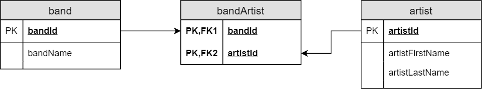
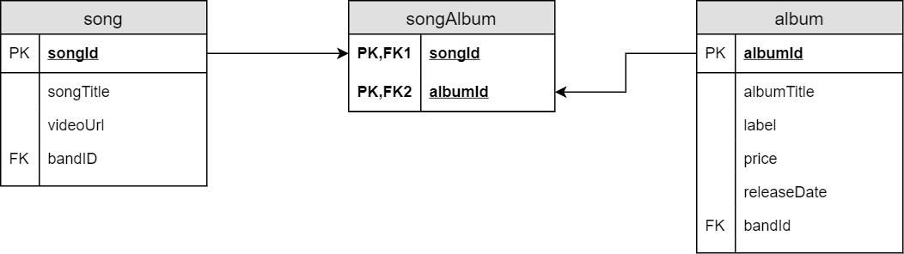
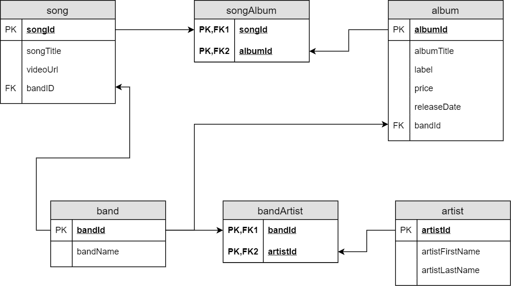
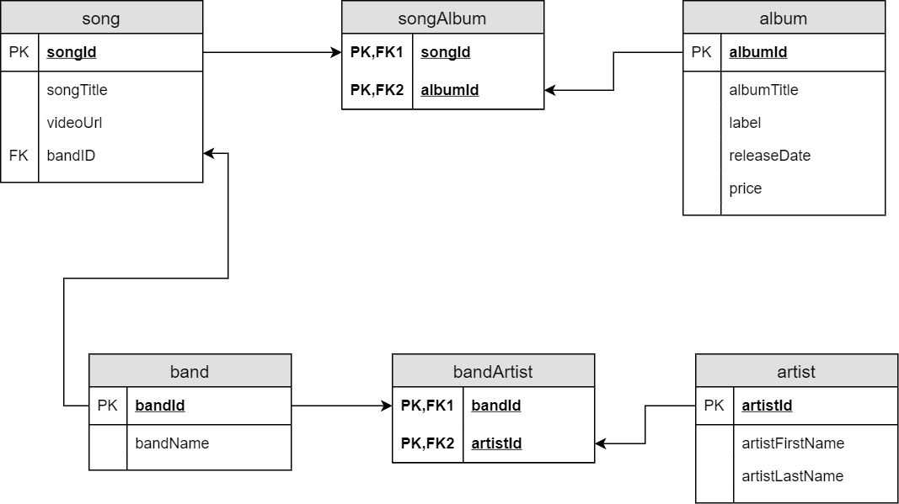
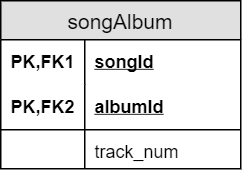
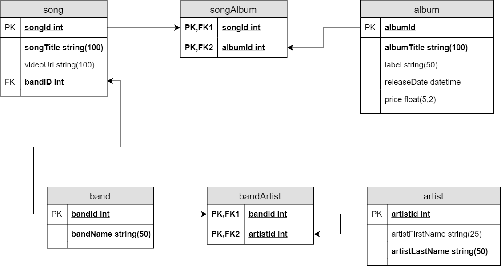

# Normalize the Vinyl Record Shop Database

### Overview
As a beginning developer, you are not likely to have to normalize large databases right off the bat. Most businesses that maintain their own databases also have a team of database specialists that handle things like that. However, you are likely to have to access data stored in a database, which means that you do need to understand how a database is structured.

In this activity, we will look at a relatively small inventory database for a vinyl music store that sells both singles and full albums. The database will support the following activities:

For each album in the database, we should be able to see:
- A list of songs on the album 
- The name of the band and/or artists that performed on the album 
- The album label 
- The price of the album 
- The album's original release date

For each song in the database, we should be able to find out:
- The title of the song 
- The name of the band and/or artists that performed the song 
- A URL for a video of the song 
- The album(s) that the song first appears on

For each band, we want to know:
- The name of the band 
- The members of the band

For each artist, we want to know:
- The name of the artist

Normalization is a theoretical process, typically done with paper and pencil or a digital drawing tool of some sort, so no computer or specific software is required. As you work through this code-along, you are encouraged to simply use pencil and paper to design the database using ERDs.

For each step, you will be given basic information that you should incorporate into your design. Attempt the design on your own before continuing to the next page to see the proposed result.

### Step 1: Identify the Entities and Attributes

As a first step, we will use the description of the planned database to identify the entities our database will include, as well as the attributes of those entities.

We use the term entity to refer to an abstract concept of a person, place, thing, or event that the database will include, so an entity is a type of proto-table whose form may change during the design process. Each entity includes attributes that will eventually become fields in the database itself.

Look over the bulleted description in the lesson overview and list out each entity you can identify, as well as the attributes of those entities, in the form of bulleted lists. Don't worry yet about applying any of the normal forms. After you have your result, go to the next page.

#### Step 1 Results

You might have noticed that the bullet list in the overview basically describes the entities we want to start with, as well as their attributes.

- album 
  - title 
  - song 
  - band/artist 
  - label 
  - price 
  - release date 

- song 
  - title 
  - videoUrl 
  - album 
  - band/artist

- band 
  - name 
  - artists

- artist 
  - name

As shown here, having a clear understanding of what the user wants from a database gives us a strong foundation for designing the database.

Your lists may not be identical to those shown here. For example, you may have already included ID values that could be used as the primary key in each entity, or you may have broken down the artist names into first name and last name. We know we'll have to do both of these eventually, so it's fine to include them. However, the focus on this step is to create a rough outline of what the database will eventually include.

While some flexibility is allowed, it would be wrong to put a song-specific value like videoUrl in the album or band entity. Make sure that each attribute is assigned to the correct entity before going on. If you aren't sure where a specific attribute goes, put it in any and all entities where you think it might be appropriate (like artists in the example above) and use normalization rules to put it in the correct place later

Note that each entity uses a singular noun as its name. This is part of the naming convention we will use in the database, so we use it here as well. We will finalize all of the field names and data types at the end of the process.

### Step 2: First Normal Form
Next, we need to make sure that each entity is in first normal form (1NF), which includes the following requirements:

- Every row/column intersection (field) contains only one value. 
- Every row can be uniquely identified.

Look at your list and put each of the entities in 1NF. This means doing the following:

1. Make sure that each entity includes a field or a set of fields that can act as the primary key. 
2. Identify any fields in the existing entities that could potentially include multiple values, based on the description given in the Overview section of this lesson, and create a separate entity for each of those fields. (Be sure to include the first entity's primary key as a foreign key in the new entity, so that you can see the relationship between them.)
3. Repeat steps 1 & 2 until each entity is in 1NF.

You may want to do this as a new diagram or set of lists, and keep your original version for reference purposes.

#### Step 2 Results

##### Primary Keys

There are no strong candidate keys in the existing entities. We could potentially use videoUrl for the songs, but while we want only one URL for each song, the reality is that most songs have multiple URLs, and it's possible that a given URL could open a playlist with multiple songs.

For the sake of simplicity, we will create a surrogate key for each entity:

* album
  * albumId (PK)
  * title
  * song
  * band/artist
  * label
  * price
  * release date

* song
  * songId (PK)
  * title
  * videoUrl
  * album
  * band/artist

* band
  * bandId (PK)
  * name
  * artists

* artist
  * artistId (PK)
  * name

##### Multi-Valued Fields

Now let's look at fields that may have more than one value.

The artist entity is close. We'll split up the name field to include separate first and last name fields, and because the word name is used to reference names in multiple entities, we'll also rename them to specifically refer to artists:

* artist
  * artistId (PK)
  * artistFirstName
  * artistLastName

A given band is likely to include multiple artists, which means that artist data will need to be in a separate entity. We also want a more descriptive name for the band name attribute.

* band
  * bandId (PK)
  * bandName
  * artistID (FK)

Now let's look at the relationship between artist and band. Remember that we are assuming for this exercise that band membership is constant and will not change.

- Any band must have at least one member, but most bands have multiple members.
- Any artist can be in multiple bands. For example, Paul McCartney was a member of the Beatles, but he later led another band named Wings.

This means that we have a many-to-many relationship between artist and band, and if we put either entity's primary key in the other entity, we will violate 1NF. The only solution is to create a new bridge entity that includes the primary key from both entities as its own primary key.

That gives us the following entities:

* band
  * bandId (PK)
  * bandName

* bandArtist
  * bandId (PK, FK)
  * artistId (PK, FK)

* artist
  * artistId (PK)
  * artistFirstName
  * artistLastName

The ERD would look like this:

Now let's look at the song entity:

* song
  * songId (PK)
  * title
  * videoUrl
  * album
  * band/artist

We want to rename the title field to distinguish it from album titles, and we are working on the assumption that any given song has a single artist. We will further simplify things by assuming that solo artists will be added as a band with one member in our database. This means that we will add bandId as a foreign key to the song entity. So far, that gives us:

* song
  * songId (PK)
  * songTitle
  * videoUrl
  * album
  * bandId (FK)

Is it possible for a given song to appear on multiple albums? Definitely. Bands and artists frequently release "best of" albums that include best-selling songs from earlier albums (not to mention compilation albums that we are ignoring for the time being).

Let's hold that thought for now and look at the album entity.

* album
  * albumId (PK)
  * title
  * song
  * band/artist
  * label
  * price
  * releaseDate

The vast majority of albums have multiple songs, so we'll have to put that somewhere else. Given our assumption that there is only one band/artist per album, though, we can simply replace that field with bandId as a foreign key. We'll also update the title attribute to specifically reference albums.

* album
  * albumId (PK)
  * albumTitle
  * label
  * price
  * releaseDate
  * bandId (FK)

Now let's look at the relationship between song and album: any song can appear on multiple albums, and most albums have multiple songs. This means that there is a many-to-many relationship and we need a bridge entity. We'll take album out of song and song out of album to create it.

* song
  * songId (PK)
  * songTitle
  * videoUrl
  * bandId (FK)

* songAlbum
  * songId (PK, FK)
  * albumId (PK, FK)

* album
  * albumId (PK)
  * albumTitle
  * label
  * price
  * releaseDate
  * bandId (FK)

We can represent this with the following ERD:

##### ERD for 1NF

Here are our entities at this point:

* band
  * bandId (PK)
  * bandName

* bandArtist
  * bandId (PK, FK)
  * artistId (PK, FK)

* artist
  * artistId (PK)
  * artistFirstName
  * artistLastName

* song
  * songId (PK)
  * songTitle
  * videoUrl
  * bandId (FK)

* songAlbum
  * songId (PK, FK)
  * albumId (PK, FK)

* album
  * albumId (PK)
  * albumTitle
  * label
  * price
  * releaseDate
  * bandId (FK)

Let's put it all together into a single ERD.

If we use the checklist for 1NF, everything meets the requirements.

- Each entity has a primary key. 
- Each attribute in each entity has a single value.

You might see the problem with the fact that bandID is a foreign key in both song and album, but that's why we don't stop at 1NF in the normalization process. We'll resolve this later.

### Step 3: Second Normal Form

Now that everything looks like its in 1NF, let's switch focus to 2NF, whose requirements are:

- All entities are in 1NF. 
- No field is partially dependent on a primary key.

Look over the structure you have now and determine what changes, if any, should be made to meet the 2NF requirements.

#### Step 3 Results

Essentially, assuming that the entities are in 1NF, 2NF applies only to entities that have composite keys. In this case, we have two such entities:

* bandArtist
  * bandId (PK, FK)
  * artistId (PK, FK)

* songAlbum
  * songId (PK, FK)
  * albumId (PK, FK)

Neither of these entities includes non-key fields, so we can move on to the next step.

### Step 4: Third Normal Form

3NF states that all entities are in 2NF (and by extension, in 1NF) and that no non-key field depends on another non-key field.

Look through the entities you have already defined. Look at each field that is not part of the primary key for that entity and determine whether it depends on a field other than the primary key.

Look over the structure you have now and determine what changes, if any, should be made to meet the 3NF requirements.

#### Step 4 Results

Both of the bridge entities (songAlbum and bandArtist) include only key fields, so we need to focus on the other entities in this step:

* band
  * bandId (PK)
  * bandName

* artist
  * artistId (PK)
  * artistFirstName
  * artistLastName

* song
  * songId (PK)
  * songTitle
  * videoUrl
  * bandId (FK)

* album
  * albumId (PK)
  * albumTitle
  * label
  * price
  * releaseDate
  * bandId (FK)

The band and artist entities are fine at this point, because the names depend on the band or artist that the entity describes.

For song, songTitle and videoURL depend on the song.

For album, albumTitle, label, releaseDate, and price depend on the album.

The only tricky part is where bandID should go.

Technically, there is nothing really wrong with having the same primary key act as the foreign key in multiple entities, as long as that relationship really represents how the two entities are related to each other. In this case, bandID must be a foreign key in the bridge entity artistBand, but we also need it to describe the relationship between the bands and the songs and the albums. This is where 3NF can help us.

While we tend to think of an album as being by a single artist or band, the reality is that an album is a collection of songs by a single artist or band (at least on our working assumption that we will list only one artist or band per song and album). This means that the band on an album depends on the songs on that album, rather than on the album itself. If we have band information about each song, and a list of songs on each album, we can identify the artist(s) on an album if we know what songs are on the album.
ERD in 3NF

This gives us the final normalized set of entities:

* band
  * bandId (PK)
  * bandName

* artist
  * artistId (PK)
  * artistFirstName
  * artistLastName

* song
  * songId (PK)
  * songTitle
  * videoUrl
  * bandId (FK)

* album
  * albumId (PK)
  * albumTitle
  * label
  * releaseDate
  * price

* bandArtist
  * bandId (PK, FK)
  * artistId (PK, FK)

* songAlbum
  * songId (PK, FK)
  * albumId (PK, FK)

And the ERD looks like:

### Step 5: Finalize the Structure

After each change in the design and especially when you reach the end of the initial design steps, you want to go back through the existing entities and start over again with 1NF, to be sure that the final design meets the needs of the database.

At this point, the database is in 1NF: each entity has a primary key, and each attribute will store exactly one value.

It's also in 2NF: the only entities with a composite key are songAlbum and bandArtist, and neither entity includes a non-key attribute at all.

For 3NF, each attribute describes only the entity it is in and depends on the primary key of that entity.

Is this the only potential design? Not really, and because database design is as much art as science, it's quite possible for two different designers to come up with slightly different designs, both of which are in 3NF. For example, this design depends on treating solo artists as bands in their own right, so that we can identify what artist performs what song. An alternative approach could be to have a songArtist bridge entity and treat bands as artists, or to have two separate bridge entities: songArtist and songBand, depending on whether the song is by a single artist or a band of multiple artists.

Another consideration is the label attribute. Any given label will produce multiple albums, so there is a potential to have a separate label entity in the event that we want to include more than just the name of the label. However, given that an album is produced by exactly one label and we only really need the name of the label for this database, we can leave this as-is and consider it a denormalization step that can make the database more efficient.

This structure does, however, allow us to account for compilation and "best of" albums relatively easily, because the association between the artist and the album depends on the songs, rather than on the artist.

Another advantage is that we could keep track of the track number of each song on a given album. Because the track number depends on both what song it is and what album it is on, we simply add it as a non-key field to songAlbum, like so:

### Final Steps

The final step is to identify the data type for each attribute in each entity. While the exact data types you will use are dependent on the RDBMS that will handle the database, we can use generic data types at this point and convert to specific data types when we are ready to build the tables. We can also identify which attributes are required for each table. For example, we must include a title for each song, but we may not have a URL to use for the video.

- We have already identified the naming convention for tables (singular in cascalCasing). We will use the same conventions for field names. 
- All primary keys will be integers. 
- Required fields are in bold. 
- Non-key datatypes will be strings, dates, or numbers, depending on the data the field will hold.
  - We include the maximum field size for string columns, e.g., STRING(25) for a text field that will store a maximum of 25 characters.
- We will split the artist's name into first name and last name.

In list format, the final version of the database looks like:

