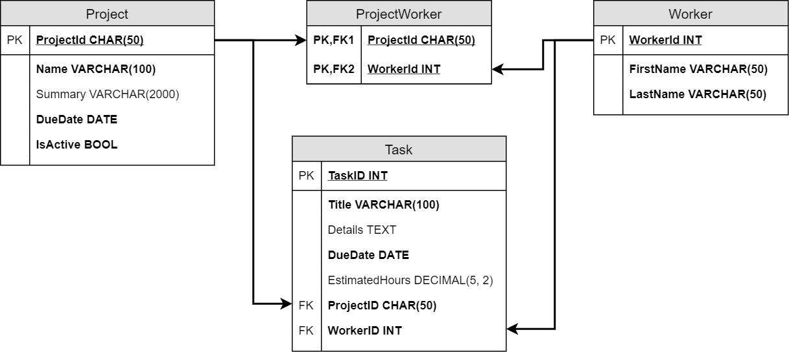

# DML

## Create a Database

### 1. Build a Database

Before we can perform DML operations on a database, we need a database. For this lesson, we will use the TrackIt! database, whose structure is defined in the following ERD.

Here is the SQL script to create this database.

        DROP DATABASE IF EXISTS TrackIt;
        
        CREATE DATABASE TrackIt;

        -- Make sure we're in the correct database before we add schema.
        USE TrackIt;
        
        CREATE TABLE Project (
            ProjectId CHAR(50) PRIMARY KEY,
            `Name` VARCHAR(100) NOT NULL,
            Summary VARCHAR(2000) NULL,
            DueDate DATE NOT NULL,
            IsActive BOOL NOT NULL DEFAULT 1
        );
        
        CREATE TABLE Worker (
            WorkerId INT PRIMARY KEY AUTO_INCREMENT,
            FirstName VARCHAR(50) NOT NULL,
            LastName VARCHAR(50) NOT NULL
        );
        
        CREATE TABLE ProjectWorker (
            ProjectId CHAR(50) NOT NULL,
            WorkerId INT NOT NULL,
            PRIMARY KEY pk_ProjectWorker (ProjectId, WorkerId),
            FOREIGN KEY fk_ProjectWorker_Project (ProjectId)
                REFERENCES Project(ProjectId),
            FOREIGN KEY fk_ProjectWorker_Worker (WorkerId)
                REFERENCES Worker(WorkerId)
        );
        
        CREATE TABLE Task (
            TaskId INT PRIMARY KEY AUTO_INCREMENT,
            Title VARCHAR(100) NOT NULL,
            Details TEXT NULL,
            DueDate DATE NOT NULL,
            EstimatedHours DECIMAL(5, 2) NULL,
            ProjectId CHAR(50) NOT NULL,
            WorkerId INT NOT NULL,
            FOREIGN KEY fk_Task_ProjectWorker (ProjectId, WorkerId)
                REFERENCES ProjectWorker(ProjectId, WorkerId)
        );

Read through the script to see how it reflects the ERD. Note the following features in particular:

* WorkerId and TaskId are set up as auto-incrementing integer fields. This means that MySQL will automatically assign values to those fields when data is added to the Worker and Task tables.
* ProjectId is a CHAR(50) field. This allows us to use meaningful values (like db-milestone) to identify projects rather than integers that have no inherent meaning.
* We can define the primary key of a table as part of the field definition when there is only one field in the primary key, like WorkerId INT PRIMARY KEY AUTO_INCREMENT.
* When we have a composite key, we must use a separate PRIMARY KEY definition that includes all appropriate fields: PRIMARY KEY pk_ProjectWorker (ProjectId, WorkerId)
* In the Project table, we set a default value of 1 to the boolean IsActive field: IsActive BOOL NOT NULL DEFAULT 1. This means that if we do not specify a value, MySQL will automatically set that value in each new record.

### 2. Create the Database

You can run this script in one of two ways:

* Copy the text in the script above. After connecting to MySQL, paste the text at the MySQL prompt (if you are using a command line interface, like Windows Command Prompt or Mac Terminal) or in the code editor window (if you are using a GUI like MySQL Workbench). Run the code after pasting it. This will run each statement individually until it reaches the last statement.
* Copy the text to a new text file using a text or code editor. Save the file with the name TrackIt.sql. Open the file in your MySQL interface to run it. This will run all statements in the script until there is an error or reaches the end of the script. If there is an error, the script will stop at that point and not run any subsequent statements in the script.

Even if you choose to use the first method, it can be useful to have a local copy of the script saved to your computer, using the instructions in the second method to create the file.

> Important!  
> This script deletes the existing TrackIt database from the MySQL server before rebuilding it, including any data that you may have added since creating the database. You should run this script only if you need to rebuild the database to start this lesson over again from the beginning.

### 3. Check that the Database Exists

After creating the database, perform the following steps to make sure that the script worked as expected:

* Show the available databases: SHOW DATABASES; You should see the trackit database in the list.
* Use the new database: USE trackit;
* Check that the database includes the appropriate tables: SHOW TABLES;

You should see the following tables in the results:

        Tables_in_trackit
        ------------------
        project
        projectworker
        task
        worker

If any of these steps do not work as expected, use the instructions above to try again.

> You will not be able to complete the steps in this lesson if you do not have a working TrackIt database!

## Insert Data

We must have data in the database if we want to manipulate the data. The TrackIt script provided earlier in this lesson creates the structure (also sometimes called the schema) of the database, but it does not add data to any of the tables.

We use INSERT statements to add data to an existing table. The basic structure is:

        -- Square brackets mark an optional clause.
        INSERT INTO TableName [( column list... )]
            VALUES ( value list... );

This boils down to two basic options:

First option: Use the INSERT statement to add values to the table without explicitly identifying the columns the values should be added to. In this case, the RDBMS will map each value to existing fields in the same order the fields appear in the table, from left to right.

Example: Assume a table that includes fields named SandwichName, Cheese, and IsFried, in that order:

        INSERT INTO Sandwich VALUES ('Monte Cristo', 'Emmental', 1);

With this option, you must provide a value or specify a null value for each column in the table, except for auto-increment fields. For example, if the Cheese column is nullable, you could use:

        INSERT INTO Sandwich VALUES ('PB&J', '', 0);

This specifies that no value will be added to the Cheese column for that record.

> To enter a null value into a string field, you simply include an empty pair of quotation marks. For other data types, use a comma before and after the empty spot, but do not include anything between the commas, like  
> 'value1', ,'value3'.

Second option: Include column names as well as values. In this case, the RDBMS will map each column to each value in the same order they are presented in the INSERT statement, even if this is not the order in which the columns appear in the table.

Example:

        INSERT INTO Sandwich (SandwichName, Cheese, IsFried)
            VALUES ('Monte Cristo', 'Emmental', 1);

This statement will work regardless of the order in which the columns are defined in the table. However, if you name a field, you must provide a value or specify a null value for that field in the list of values.

The second option is generally the better choice because tables change over time and your INSERT assumptions will grow stale.

### 1. Considerations

Before writing an INSERT statement, ask these questions:

* Does the table have auto-incremented columns?
* Which columns allow nulls?
* Are there foreign key columns?
* Are foreign key values nullable?

If you omit the value for an auto-incremented column, the database engine generates the value for you. If you include a value, MySQL allows insertion without safeguards. Other database systems, like Microsoft SQL Server, prevent insertion without temporarily disabling auto-increment.

If a column is defined NOT NULL and does not have a DEFAULT value, you must provide a value in your insert statement.

If a column is a foreign key, any value you provide must already exist in the related primary table. If that column is nullable, you can choose to leave these values out when adding data, but if the column is not nullable, you must provide an allowed value.

For example, in ProjectWorker, both the ProjectId and WorkerId must be set to values that exist in the Project and Worker tables. If the values don't exist in the related tables, the INSERT will fail because of referential integrity. Because the columns are not nullable, you must provide a value or the INSERT will fail because of the column settings.

Let's add a Worker to our table:

        INSERT INTO Worker (WorkerId, FirstName, LastName)
            VALUES (1, 'Rosemonde', 'Featherbie');

As long as WorkerId 1 doesn't exist, Rosemonde is inserted without error and is given the WorkerId value 1. On success, we see the message, "1 row(s) affected."

If you run the same statement a second time, however, you will see an error message like "Error Code: 1062. Duplicate entry '1' for key 'PRIMARY'." This is because we cannot have two records with the same primary key value in the same table.

Because we have set up auto-increment on WorkerId, however, we don't need to include a value for that field.

        INSERT INTO Worker (FirstName, LastName)
            VALUES ('Kingsly', 'Besantie');

If Kingsly is the second worker inserted, they receive the WorkerId value 2.

You can view the contents of the table using the following SELECT statement:

        SELECT *
        FROM Worker;

If both records were inserted correctly, you will see results like:

        WorkerId    FirstName   LastName
        1           Rosemonde   Featherbie
        2           Kingsly     Besantie

Pay attention to output messages you get from MySQL. If your data doesn't INSERT, the message will point you in the right direction. Other common problems include trying to add a value with the wrong data type, such as adding a string to a number field.

### 2. Inserting Multiple Rows

To insert multiple rows with one query, comma separate two or more value lists, including parentheses.

        INSERT INTO Worker (FirstName, LastName) VALUES
            ('Goldi','Pilipets'),
            ('Dorey','Rulf'),
            ('Panchito','Ashtonhurst');

Select all Worker records and inspect their WorkerIds.

        SELECT *
        FROM Worker;

You should see the output like the following:

        WorkerId    FirstName       LastName
        1           Rosemonde       Featherbie
        2           Kingsly         Besantie
        3           Goldi           Pilipets
        4           Dorey           Rulf
        5           Panchito        Ashtonhurst

### 3. More Auto-Increment

What happens when we insert a WorkerId higher than the next auto-increment value?

    INSERT INTO Worker (WorkerId, FirstName, LastName)
        VALUES (50, 'Valentino', 'Newvill');

Now add a new record without specifying a WorkerID:

    INSERT INTO Worker (FirstName, LastName)
        VALUES ('Violet', 'Mercado');

Will this record have WorkerID 6 or 51? Run a SELECT statement to find out.

        SELECT *
        FROM Worker;

MySQL uses the next value after the current max value for the next auto-increment value.

        WorkerId    FirstName   LastName
        1           Rosemonde   Featherbie
        2           Kingsly     Besantie
        3           Goldi       Pilipets
        4           Dorey       Rulf
        5           Panchito    Ashtonhurst
        50          Valentino   Newvill
        51          Violet      Mercado

### 4. Inserting a Foreign Key

Worker is a primary table, so it does not have any foreign key columns. Let's see how foreign key values work.

Start by adding a record to the Project table.

    INSERT INTO Project (ProjectId, `Name`, DueDate)
        VALUES ('db-milestone', 'Database Material', '2018-12-31');

* A ProjectId is assigned, not generated, so we specify the value.
* Summary is nullable so we can safely omit the column name and value.
* IsActive has a DEFAULT value of 1, so again we can omit the column name and value if we're happy with the default.

Now to assign a Worker to a Project, we INSERT values into the ProjectWorker table.

    INSERT INTO ProjectWorker (ProjectId, WorkerId)
        VALUES ('db-milestone', 75);

Because WorkerId 75 does not exist in the Worker table, the database engine rejects the query with the error message:

> Error Code: 1452. Cannot add or update a child row: a foreign key constraint fails (`trackit`.`projectworker`, CONSTRAINT `fk_ProjectWorker_Worker` FOREIGN KEY (`WorkerId`) REFERENCES `worker`(`workerid`))

The message is a mouthful. In plain English, it says we tried to insert a WorkerID value that doesn't exist in the Worker table and therefore violated the fk_ProjectWorker_Worker constraint.

Change the WorkerId value from 75 to 2 and the query will work properly.

This is one way relational databases protect you from bad data. ProjectWorker requires a ProjectId that exists in Project and a WorkerId that exists in Worker, to conform to referential integrity.

Add a second project and assign workers:

        INSERT INTO Project (ProjectId, `Name`, DueDate)
            VALUES ('kitchen', 'Kitchen Remodel', '2025-07-15');

        INSERT INTO ProjectWorker (ProjectId, WorkerId) VALUES
            ('db-milestone', 1), -- Rosemonde, Database
            ('kitchen', 2),      -- Kingsly, Kitchen
            ('db-milestone', 3), -- Goldi, Database
            ('db-milestone', 4); -- Dorey, Database

Run SELECT statements for Project and ProjectWorker to verify that the data was added to the tables correctly.

        SELECT *
        FROM Project;

        SELECT *
        FROM ProjectWorker;

## Update Data

The UPDATE statement is used to change record values in a table. Its basic structure is:

        UPDATE TableName SET
            Column1 = [Value1],
            Column2 = [Value2],
            ColumnN = [ValueN]
        WHERE [Condition];

* UPDATE TableName limits changes to the named table.
* One or more columns are assigned values, separated by commas, following the SET keyword.
* [Value] can be a value literal, another column, or even a query result.
* The WHERE [Condition] clause is a boolean expression, using AND, OR, or any boolean operators in any combination to limit records to be modified.

> Watch that WHERE!  
That WHERE clause is important. Without it, you impact the whole table: every record.  
Databases do not have an "undo" command, so if you forget the WHERE on a query that updates a million records, you are going to have a very humbling conversation with your database administrator!

### 1. Updating One Row

Because primary key values are unique to each row of a table, you can use the WHERE clause to specify the primary key value to affect only that row. This is recommended whenever possible.

        -- Provide a Project Summary and change the DueDate.
        UPDATE Project SET
            Summary = 'All lessons and exercises for the relational database milestone.',
            DueDate = '2018-10-15'
        WHERE ProjectId = 'db-milestone';

        -- Change Kingsly's LastName to 'Oaks'.
        UPDATE Worker SET
            LastName = 'Oaks'
        WHERE WorkerId = 2;

> Preview before you UPDATE!  
If a query is likely to impact many rows (as any query can), it's a good practice to estimate the affected rows and make sure your WHERE condition is correct. For example, if you are updating customers in Louisiana, and you know there are more than 10,000, a row count of 15 should raise a red flag.  
DBAs often run SELECT statements with the same WHERE clause they plan to use in an UPDATE (or DELETE) before they execute the UPDATE or DELETE. If the SELECT results are suspicious, there's likely something wrong with the condition. Remember, there's no undo in SQL!

### 2. Updating Multiple Rows

A WHERE clause can also capture many rows if it does not use a primary key field or if a range of values is selected. For example, let's say that we want to reassign all of Oaks's (WorkerId 2) projects to Ashtonhurst (WorkerId 5). In the ProjectWorker table, WorkerId is a foreign key, so two records currently have that value:

        ProjectId       WorkerId
        db-milestone    1
        db-milestone    2
        kitchen         2
        db-milestone    3
        db-milestone    4

If we run the following UPDATE statement, only those WorkerId values will be affected:

        UPDATE ProjectWorker SET
            WorkerID = '5'
        WHERE WorkerId = 2;

Only those two records are updated:

        ProjectId       WorkerId
        db-milestone    1
        db-milestone    3
        db-milestone    4
        db-milestone    5
        kitchen         5

> Why did the record order change?  
One of the foundations of relational databases is that the order of records is not important. As a result, the database engine normally uses index values to sort output unless the SELECT statement specifies a different sort order. In this case, the index of kitchen + 5 is higher than the index of kitchen + 2, so it appears later in the results.

### 3. Disabling SQL_SAFE_UPDATES

If you want to update every row in a table, omit the WHERE clause. Some MySQL instances are configured to prevent an UPDATE without a WHERE. You can disable safe update configuration with a statement.

        SET SQL_SAFE_UPDATES = 0;

Be sure to re-enable safe updates after you're done.

        SET SQL_SAFE_UPDATES = 1;

Be aware that SQL_SAFE_UPDATES also prevent broad WHERE conditions (non-identifying). You'll have to disable them.

        -- Disable safe updates.
        SET SQL_SAFE_UPDATES = 0;
        
        -- Deactivate active Projects from 2017.
        UPDATE Project SET
            IsActive = 0
        WHERE DueDate BETWEEN '2017-01-01' AND '2017-12-31'
        AND IsActive = 1;
        
        -- Enable safe updates.
        SET SQL_SAFE_UPDATES = 1;

It's also possible to UPDATE based on a column value.

        -- Do you need safe updates disabled?

        -- Update all of Kingsly's Task estimates to include 25% more time.
        UPDATE Task SET
            EstimatedHours = EstimatedHours * 1.25
        WHERE WorkerId = 2;

As long as you are working in your own private database and you have a way to restore the database and its data, you can disable safe updates at your own risk. In a real working database, however, you would not want to do this. In fact, in an enterprise-level database, user permissions will likely prevent anyone other than admins from changing this setting.

## Delete Data

The DELETE statement is used to delete rows from a table. Its basic structure is:

        DELETE FROM TableName
        WHERE [Condition];

* DELETE FROM TableName limits row removal to the named table.
* Just like SELECT and UPDATE, the WHERE [Condition] clause evaluates to a boolean. If the result is true for a record, the record is deleted. If not, the record is ignored by the DELETE statement.

Deletes are all or nothing. There is no partial-row delete option. If you simply want to delete a couple of values in the record, use an UPDATE statement to set those values to null (assuming the columns are nullable).

> Remember: There is no undo in SQL!  
As with UPDATE statements, you should execute a SELECT statement with the same WHERE clause you plan to use in a DELETE statement before running the DELETE statement, to make sure you are identifying those records correctly before you delete them.

As with UPDATE statements, it is best to use primary key values to identify specific records in the WHERE clause of the DELETE statement. Let's delete WorkerID 50:

        DELETE FROM Worker
        WHERE WorkerId = 50;

If it works as expected, you will receive a confirmation message that 1 row was affected and that row will no longer appear in the table.

        SELECT * FROM Worker;

        WorkerId    FirstName   LastName
        1           Rosemonde   Featherbie
        2           Kingsly     Oaks
        3           Goldi       Pilipets
        4           Dorey       Rulf
        5           Panchito    Ashtonhurst
        51          Violet      Mercado

Now let's try deleting Panchito, whose WorkerId is 5.

        DELETE FROM Worker
        WHERE WorkerId = 5;

This time, we get an error message.

> ERROR 1451 (23000): Cannot delete or update a parent row: a foreign key constraint fails (`trackit`.`projectworker`, CONSTRAINT `projectworker_ibfk_2` FOREIGN KEY (`WorkerId`) REFERENCES `worker` (`WorkerId`))

If you look carefully, you'll see that it is exactly the same error message we saw earlier when we used the UPDATE statement that violated referential integrity. Because WorkerId 5 appears in the WorkerProject table as a foreign key, we cannot remove that record from the associated primary table without violating referential integrity.

DELETE is a form of UPDATE, so maybe SQL_SAFE_UPDATES will let us work around the problem.

        -- Safe updates also prevent DELETE.
        SET SQL_SAFE_UPDATES = 0;
        
        DELETE FROM Worker
        WHERE WorkerId = 5;
        
        SET SQL_SAFE_UPDATES = 1;

Referential integrity wins:

> Error Code: 1451. Cannot delete or update a parent row: a foreign key constraint fails (`trackit`.`projectworker`, CONSTRAINT `fk_ProjectWorker_Worker` FOREIGN KEY (`WorkerId`) REFERENCES `worker` (`workerid`))

> WARNING!  
When you execute a SQL script (as opposed to running individual SQL statements) and any statement in the script results in an error, the database engine stops running the script immediately. Because our DELETE failed, the statement SET SQL_SAFE_UPDATES = 1; never ran. Our safe updates are still disabled! Be careful after an error. Be sure your data, schema, and database configuration are what you assume.

If we truly want to delete Panchito, we have to delete all records that reference his primary key in the related tables first. Once those records are gone, referential integrity no longer applies and we can remove the record from the primary Worker table.

        SET SQL_SAFE_UPDATES = 0;

        -- Delete Tasks first because Task references ProjectWorker.
        DELETE FROM Task
        WHERE WorkerId = 5;
        
        -- Delete ProjectWorker next.
        -- That removes Kingsly from all Projects.
        DELETE FROM ProjectWorker
        WHERE WorkerId = 5;
        
        -- Finally, remove Panchito.
        DELETE FROM Worker
        WHERE WorkerId = 5;
        
        SET SQL_SAFE_UPDATES = 1;

View the table contents to verify that the data has been deleted.

        SELECT *
        FROM Task;

        SELECT *
        FROM ProjectWorker;

        SELECT *
        FROM Worker;

