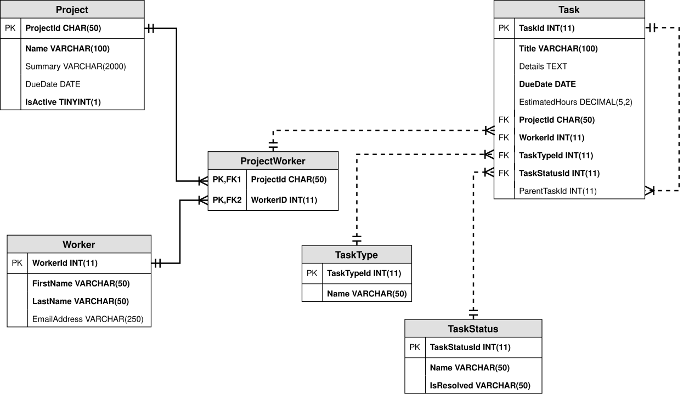
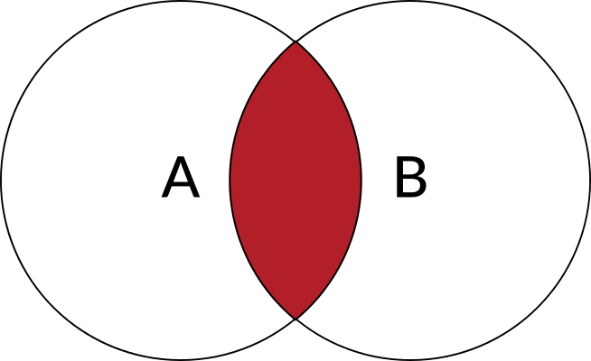
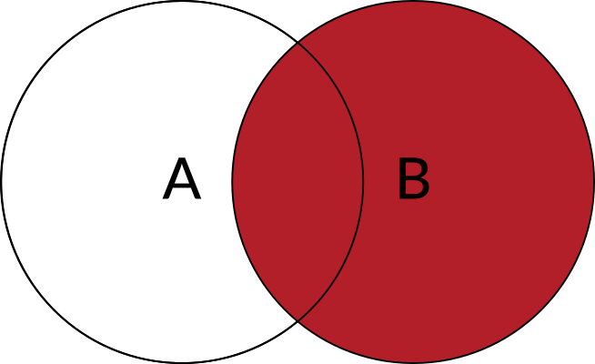
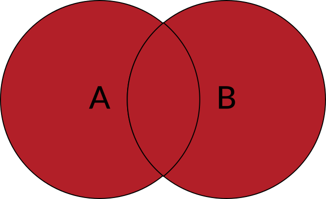

# Retrieving Data

## SELECT Queries

### Setup: Database

Before we begin, we need a database. Let's try a consumer complaint dataset from Data.gov. Data.gov includes over a quarter million open datasets from federal, state, local, and tribal governments. The data is interesting in its own right, but it is also excellent for practice. Without too much trouble, we can import real-world, meaningful data, decide how to model it, write complex queries, and optimize.

The consumer complaints are anonymous in the original dataset. To keep both sides anonymous, we will use a dataset where we have replaced actual companies with fictional companies.

To create the database:

* Download consumer-complaints-schema-and-data.sql
* Execute the script in MySQL, using MySQL Workbench or a MySQL command line.

Take a moment to review the script. (It's big!) Look for SQL syntax. Note the semicolons and flexible whitespace.

> Reminder: Database Context  
Because a DBMS can handle multiple databases, you must explicitly tell the DBMS which database you want to use, even if you only have one database available. You do this with a USE statement.  
> 
>        USE ConsumerComplaints;
>
> Technically, the database will continue to use the same database until you issue a USE statement for another database, but we recommend you start each query tab and .sql file with a USE statement. This reduces confusion about what database the queries reference and avoids problems that might occur if you accidentally run the queries with a different database.
> 
> With the USE statement on top, the SQL execution engine switches the database context to ConsumerComplaints before anything else executes. This is a good habit to get into, especially if your script changes a database's schema or writes data. A little bit of caution goes a long way in preventing unnecessary mistakes.
> 
> Many teams and database administrators require a leading USE. Even if they don't, it makes sense to protect yourself. Always put a USE statement at the top of your queries.

### 1. SELECT

The SELECT keyword is used to retrieve data from one or more tables in a database. SELECT statements are queries (or requests) for information, and they can be as simple as retrieving all data from a single table or as complex as performing functions on the data to create new data.

SELECT statements are generally safer than the other DDL keywords INSERT, UPDATE, and DELETE because they do not change any data in any way. At worst, you will get an error or other unexpected results because you failed to name a table or field correctly or formatted the `WHERE` clause incorrectly.

#### 1.1. Single Table SELECT

The simplest query is a SELECT statement written for a single table. Its structure is:

        SELECT ColumnName1, ColumnName2, ColumnNameX
        FROM TableName;

Now let's apply the pattern to our database. First, examine the Complaints table in the ConsumerComplaints database using either of the options below:

1. Run a DESCRIBE command at a MySQL prompt:

        USE ConsumerComplaints;
        
        DESCRIBE Complaint;

2. Find the MySQL Workbench Schemas panel. 
   1. Navigate: ConsumerComplaints > Tables > Complaints > Columns 
   2. Expand the Columns node.

You should see 18 columns, including ComplaintId, DateReceived, Product, ComplaintNarrative, and more.

To view a list of the dates received, products, companies, and states, we write the following statement and execute it:

        USE ConsumerComplaints;

        SELECT DateReceived, Product, Company, State
        FROM Complaint;

The following table shows only five of the records included in the table:

        DateReceived    Product         Company                         State
        2012-05-21      Mortgage        Goyette, Champlin and Padberg   IL
        2012-05-21      Credit card     Legros, Heathcote and Wisoky    AZ
        2012-05-21      Mortgage        Little, Crist and Terry         MN
        2011-12-23      Credit card     Veum Group                      MD
        2011-12-30      Credit card     Legros, Heathcote and Wisoky    WA

Your top five results may be different as we're relying on the data's natural order, or the order the data is stored on disk. SQL execution engines don't guarantee an order unless we specifically ask. More on that later.

#### 1.2. SELECT *

If you want all columns, you don't have to list them explicitly. SQL gives us a shortcut. Use the asterisk * symbol:

        USE ConsumerComplaints;
        
        SELECT *
        FROM Complaint;

Be careful with * queries. They're great for a quick look at all columns in a table, but in live applications, it's wasteful to select everything when you don't need it. Say you need three columns from a table with 10,000 rows and 30 columns. If you SELECT *, you are selecting 27,000 extra values for nothing! That's a lot of network traffic, server processing, and client processing.

### 2. The WHERE Clause

So far, our queries fetch every row in Complaints. There are 1,000 records, but 1,000 records might be less useful than we imagine.

To see why, consider a search engine. How many times have you clicked to the second page of your search results? How about the third? Search engines display between 10 and 25 results per page. That means you'd have to click through at least 40 pages of results to see all 1,000. No one is that patient. We need a way to focus in on what's relevant. Maybe we only care about records for a specific state, specific company, or a limited date range. SQL uses the WHERE clause to filter the output to relevant results.

The WHERE clause is a conditional expression, which means it resolves to a boolean, TRUE or FALSE, for each record in the table. If the expression is true for a record, the record is included in the result. If not, it is excluded.  
We can build complex boolean expressions using AND, OR, and NOT (!).

#### 2.1. Common WHERE Operators  
        Expression  Usage 	                                                        Example
        =           Equals 	                                                        State = 'LA'
        != , <>     Not equals                                                      State != 'LA'
                                                                                    State <> 'LA'
        AND         And (both conditions must be true)                              State = 'LA' AND Product = 'Mortgage'
        OR          Or (at least one condition must be true)                        State = 'LA' OR Product = 'Mortgage'
        IN          Match a list of values;                                         State IN ('LA', 'AZ', 'TX')
                    This is a shorter way of writing a long list of OR conditions
        NOT IN      Not in a list of values                                         State NOT IN ('LA', 'AZ', 'TX')

The WHERE clause follows the FROM clause in a SELECT statement.

        USE ConsumerComplaints;

        -- Two dashes is a SQL comment. This line is ignored.
        -- If your query has many columns, you may want to stack them for readability. -- Whitespace is ignored.
        
        SELECT
            DateReceived,
            Product,
            Issue,
            Company
        FROM Complaint
        WHERE State = 'LA';

The result should include 13 records. Here are five of those records.

        DateReceived    Product                     Issue                                       Company
        2013-03-26      Mortgage                    Loan servicing, payments, escrow account    Cartwright, Sporer and Nader
        2014-04-04      Bank account or service 	Making/receiving payments, sending money    Cassin-VonRueden
        2014-04-09      Credit reporting            Incorrect information on credit report      Welch, Bashirian and Bauch
        2014-08-27      Bank account or service     Account opening, closing, or management     Medhurst-Cole
        2015-06-24      Debt collection             Cont'd attempts collect debt not owed       Jacobi, Adams and Prosacco

Practice:

* Try the other common WHERE conditions. Examine the results.
* Use different states.
* Limit results by Product, Issue, or SubmissionMethod.
* Build a complex expression using AND or OR.

How many records are fetched with the following query?

        USE ConsumerComplaints;
        
        SELECT *
        FROM Complaint
        WHERE State = 'LA'
        AND (Product = 'Mortgage' OR Product = 'Debt collection');

We can force boolean operator precedence by using parentheses, just like math. How many records are fetched if we remove the parentheses?

        USE ConsumerComplaints;
        
        SELECT *
        FROM Complaint
        WHERE State = 'LA'
        AND Product = 'Mortgage' OR Product = 'Debt collection';

#### 2.2. Filtering Numbers

Different columns can hold different types of data and the types may have different conditional operators. Numeric columns can be filtered using math comparison operators like < (less than) or >= (greater than or equal). There's also a keyword BETWEEN for value ranges.

        Expression  Usage                                   Example
        =           Equals                                  ComplaintId = 1653822
        != , <>     Not equals                              ComplaintId != 1653822 ComplaintId <> 1653822
        >, >=       Greater than, Greater than or equal to  ComplaintId > 10000 ComplaintId >= 10000
        <, <=       Less than, Less than or equal to        ComplaintId < 10000 ComplaintId <= 10000
        BETWEEN     Column value in an inclusive range      ComplaintId BETWEEN 1000 AND 30000

Note that BETWEEN is inclusive, which means that both values entered in the statement will be included in the results. In the example above, ComplaintId BETWEEN 1000 AND 30000 will include both Complaint 1000 and Complain 30000, as well as every record in between.

Comparison operators can be used to answer questions like the following:

* Does ComplaintId 1200385 exist?
* How many Complaints are there with a ComplaintId less than 100,000?
* What is the most common Product between ComplaintId 100,000 and 200,000?

Guessing a bit about the column meanings, what does the following query do? How many rows does it return?

        USE ConsumerComplaints;
        
        SELECT
            Product,
            Issue,
            Company,
            ResponseToConsumer
        FROM Complaint
        WHERE ConsumerDisputed = 1
        AND ConsumerConsent = 1
        AND Product NOT IN ('Mortgage', 'Debt collection');

#### 2.3. Filtering Dates

Relational databases store dates as a specific data type. The DATE type is small and fast, two attractive qualities for a data storage system. Dates can use many of the numeric operators; conceptually, we can think of a date as bigger or smaller than another date.

        Expression  Usage                                   Example
        =           Equals                                  DateReceived = '2017-07-04'
        != , <>     Not equals                              DateReceived != '2017-07-04' DateReceived <> '2017-07-04'
        >, >=       Greater than, Greater than or equal to  DateReceived > '2017-07-04' DateReceived >= '2017-07-04'
        <, <=       Less than, Less than or equal to        DateReceived < '2017-07-04' DateReceived <= '2017-07-04'
        BETWEEN     Column value in an inclusive range.     DateReceived BETWEEN '2017-01-01' AND '2018-01-01'

Date literals, e.g., '2017-07-04', are delimited with single ticks like strings. They are not strings under the hood, however. The SQL execution engine converts them to the date type if they have the proper format. The format 'yyyy-MM-dd' is understood by MySQL and most other databases.

Date filters can be used to answer questions like the following:

* Did anyone submit a complaint on New Year's Day, 2014?
* Are there complaints in 2018?
* How many complaints were reported in July of 2015?
* Do any complaints claim to have been sent to the company (DateSentToCompany) before the complaint was received (DateReceived)?

#### 2.4. Pattern Matching Text

SQL can match patterns in strings and text. The LIKE operator works from a string example. If a column value matches the example, the record is included.

The example string may contain characters with special meaning, which differentiates LIKE from simple string comparisons. Special characters include:

* % (percent)
  * Matches any number of characters, including no characters.
* _ (underscore)
  * Matches any single character.

If you want to match the literal value '%' or '_', escape them with a backslash: '\%', '_'.

Examples:

        Expression 	    Description                                                                         Does Not Match      Matches
        
        LIKE 'A%' 	    Matches strings that start with the letter 'A'. (case insensitive by default)       Banana              Apple
                                                                                                            @#&?!               a
                                                                                                            cream               atom
                                                                                                            corn                Antagonist

        LIKE 'a%c' 	    Matches strings that start with 'a', end with 'c',                                  a brick             AC
                        and have any number of characters in between.                                       atom                Al's bric-a-brac
                                                                                                            bucolic             All is quiet. Calm yourself. Don't be dogmatic

        LIKE '%space%'  Matches strings that contain the value 'space' anywhere. 	                        apostrophe          outerspace
                                                                                                            ace                 spaceship

        LIKE '%'        Matches all strings. Therefore, it's not particularly useful.                                           tab, space, and newline
                                                                                                                                Any value works!

        LIKE '_at'      Matches strings that start with any single character and end with 'at'.             brat                bat
                                                                                                            phat 	            cat

        LIKE '___'      Matches any string exactly three characters long.                                   too long            abc
                                                                                                                                !!!
                                                                                                                                cat

We can use wildcards to answer questions like the following:

* Find consumer complaints about companies with names that start with 'V'.
* Find complaints that use the word 'whom' in their ComplaintNarrative.
* What are the SubmissionMethods with exactly three characters?
* Which Complaints mention 'loan' in their Issue?

#### 2.5. NULL – the "Billion-Dollar Mistake"

(See the page at Null References: The Billion Dollar Mistake)

The value NULL is special. It represents an unset value or missing information. Any table column can be configured to accept or reject NULL values, even columns that store numbers. Unfortunately, NULL is impervious to many operators in the WHERE clause. For example, none of these work:

        USE ConsumerComplaints;
        
        -- Doesn't work.
        SELECT *
        FROM Complaint
        WHERE SubProduct = NULL;-- But neither does this!SELECT * FROM Complaint WHERE SubProduct != NULL;
        
        -- Doesn't complain, but doesn't find anything.
        SELECT *
        FROM Complaint
        WHERE ComplaintId BETWEEN 15000 AND NULL;
        
        -- Nope.
        SELECT *
        FROM Complaint
        WHERE SubIssue IN ('Account status', NULL);

To find NULL values, we have to use the special operator IS. Then we can express that a value IS NULL or IS NOT NULL. Our queries can be rewritten:

        USE ConsumerComplaints;
        
        SELECT *
        FROM Complaint
        WHERE SubProduct IS NULL;SELECT * FROM Complaint WHERE SubProduct IS NOT NULL;
        
        SELECT *
        FROM Complaint
        WHERE ComplaintId > 15000 OR ComplaintId IS NULL;
        
        SELECT *
        FROM Complaint
        WHERE SubIssue = 'Account status'
        OR SubIssue IS NULL;
        
        -- All Complaints with a value for ComplaintNarrative.
        -- Exclude null values.
        SELECT *
        FROM Complaint
        WHERE ComplaintNarrative IS NOT NULL;

### 3. Performing Calculations

We can also use a SELECT query to perform calculations on existing data and produce new data.

In the current dataset, we have two DATE fields: the date on which the complaint was received (DateReceived) and the date on which the complaint was sent to the company (DateSentToCompany). We can use a SELECT query to calculate the number of days between those dates.

        USE ConsumerComplaints;
        
        SELECT
        ComplaintId,
        DateReceived,
        DateSentToCompany,
        DateDiff(DateSentToCompany, DateReceived) AS DateDifference
        FROM Complaint;

The DateDiff function returns the difference between dates. This is a new value, so we optionally name the column DateDifference using the AS keyword.

Five sample records include:

        ComplaintId     DateReceived        DateSentToCompany   DateDifference
        37              2012-05-21          2012-05-29          8
        105             2012-05-21          2012-05-21          0
        110             2012-05-21          2012-05-21          0
        7887            2011-12-23          2011-12-27          4
        8908            2011-12-30          2012-01-03          4

We can also use a calculation in the WHERE clause.

        USE ConsumerComplaints;
        
        SELECT
            ComplaintId,
            DateReceived,
            DateSentToCompany,
            DateDiff(DateSentToCompany, DateReceived) AS DateDifference
        FROM Complaint
        WHERE DateDiff(DateSentToCompany, DateReceived) > 100;

The results are:

        ComplaintId     DateReceived 	DateSentToCompany 	DateDifference
        42864           2012-03-30      2012-07-12          104
        78668           2012-05-15      2012-11-06          175
        283132          2013-01-31      2013-08-09          190
        453415          2013-07-10      2014-04-16          280
        587589          2013-11-06      2014-03-25          139

## Join Queries

### Getting Started

We will use the TrackIt schema linked below. This is different from other versions used elsewhere in this course. Download the latest script and execute it: trackit-schema-and-data.sql

The script contains a predefined set of data required for this lesson. The data is for a video game company named GameIt. Their workers (employees) contribute to software projects.

#### Primary Entities

* Project is a large chunk of work that usually results in a deliverable. Projects take months or even years to complete. In our sample data, Projects are software projects, mostly video games.
* Worker is a person available to work on a Project.
* Task is a discrete chunk of work that can be completed within several hours. A Project is completed one Task at a time.
* Project has a one-to-many relationship with Task.
* Project has a many-to-many relationship with Worker.
* Worker has a one-to-many relationship with Task.

#### New Concepts

* TaskType is a task category. Each task can have one and only one type, so TaskType has a one-to-many relationship with Task.
* TaskStatus is, well, a task status. Each task can have one and only one status, so TaskStatus has a one-to-many relationship with Task.
* A Task has an optional relationship with itself. How does that make sense? If a Task is large, we may divide it into smaller Tasks. We create a relationship between parent and child by including the parent's identifier in each child row. There's nothing in the schema preventing multiple levels of parents and children, but our sample data is only two levels deep.

#### Entity-Relationship Diagram

We can represent tables and relationships visually with an entity-relation diagram (ERD). 

This ERD represents the database schema. You may find it useful to refer to this diagram when creating JOIN queries on the database, because it shows you where each field lives and how the tables are related to each other. 

### 1. Multi-Table Data

Imagine you work at GameIt. Your manager asks for a list of Tasks that are in resolved status. It's not possible to generate the list from one table. To find resolved statuses, we look in the TaskStatus table. To find Tasks with resolved statuses, we look in the Task table for records with a resolved TaskStatusId.

First, we SELECT resolved statuses:

        USE TrackIt;
        
        SELECT *
        FROM TaskStatus
        WHERE IsResolved = 1;

Results:

        TaskStatusId    Name                    IsResolved
        5               Resolved                1
        6               Resolved, Will Not Fix  1
        7               Resolved, Duplicate     1
        8               Closed                  1

Now that we have the TaskStatusIds, we can grab Tasks.

        -- TaskStatusIds are in order, so we can use BETWEEN.
        -- If they were out of sequence, we might use an IN (id1, id2, idN).
        SELECT *
        FROM Task
        WHERE TaskStatusId BETWEEN 5 AND 8;

This query lists 276 resolved tasks, Here is a partial set of the results:

        TaskId  Title                               EstimatedHours  ProjectId   TaskStatusId
        3       Refactor service layer and classes  4.75 	        payroll     6
        5       Refactor interface                  7.75 	        payroll     6
        6       Log out                             26.25 	        payroll     8
        8       Construct service layer and classes 2.25 	        payroll     7

We found the resolved Tasks! That's good. But our results are fragile. Consider why:

* If we want both the Task title and status name displayed together, we have to combine results from the two queries manually. With 276 tasks, that's a lot of copying and pasting.
* Our second query may change each time we run it. If the resolved statuses change, where statuses are added, removed, or edited, we have to adjust our task query. We can't write our queries once and then run them whenever we like.
* Worst of all, the approach is error-prone. It's easy to make a mistake. What happens if we miss a status ID while copying or include an ID that doesn't belong?

### 2. JOIN

The JOIN clause is an optional clause in a SELECT statement. It expands a SELECT so it can retrieve results from more than one table and express relationships between rows. Rows from one table are joined to rows from another table and their values are combined in a single result.

A JOIN clause follows the FROM clause and precedes the WHERE in a SELECT. The basic structure is:

        SELECT
            Table1.Column1,
            Table1.Column2,
            Table2.Column1,
            Table2.Column2
        FROM Table1
        [Join Type] JOIN Table2 ON [Relationship Condition]
        WHERE [Filter Condition];

JOIN [Table2] adds the table, Table2, to the query and makes its rows available for retrieval and filtering.

ON [Relationship Condition] defines how rows in one table relate to rows in another.

[Join Type] modifies the JOIN. It determines how unmatched rows are handled. Valid values include INNER, LEFT OUTER, RIGHT OUTER, FULL OUTER, and CROSS. We'll look at each.

### 3. Join Using WHERE

An alternative approach to using the JOIN keyword is to use WHERE to identify related fields. This would look something like:

    SELECT
        Table1.Column1,
        Table1.Column2,
        Table2.Column1,
        Table2.Column2
    FROM Table1, Table2
    WHERE Table1.Table1_PK = Table2.Table2_FK;

This syntax requires that all tables used in the query be included in the FROM clause, while the JOIN keyword only requires one table named in the FROM clause.

Rather than using JOIN, we use WHERE to identify records where the primary key value in one table (Table1.Table1_PK) is equal to a foreign key value in the other table (Table2.Table2_FK). If additional filters are required, they can be added using the AND keyword.

        SELECT
            Table1.Column1,
            Table1.Column2,
            Table2.Column1,
            Table2.Column2
        FROM Table1, Table2
        WHERE Table1.Table1_PK = Table2.Table2_FK
        AND [Filter Condition];

The WHERE condition produces the same results that a default JOIN statement does, assuming all other factors are equal.

### 4. INNER JOIN

An INNER JOIN returns a result only when rows from both tables match on their relationship condition. Visually, if we have tables A and B, the query results are the intersection of rows that satisfy the join condition. If a row from A doesn't match a row from B, it isn't included, and vice versa.

Returning to our resolved tasks, an INNER JOIN addresses the shortcomings of our original approach. The result combines the Task title and status name and we write a single query that will work again and again. There's never a need to change it.

Consider each keyword, table name, and column name below. Map them to the basic JOIN structure. Pay special attention to the ON condition. Here, a TaskStatus record and a Task record match when they have the same TaskStatusId.

        SELECT
            Task.TaskId,
            Task.Title,
            TaskStatus.Name AS StatusName
        FROM TaskStatus
        INNER JOIN Task ON TaskStatus.TaskStatusId = Task.TaskStatusId
        WHERE TaskStatus.IsResolved = 1;

4 rows of 276:

        TaskId  Title 	                            StatusName
        3       Refactor service layer and classes  Resolved, Will Not Fix
        5       Refactor interface                  Resolved, Will Not Fix
        6       Log out                             Closed
        8       Construct service layer and classes Resolved, Duplicate

It is very likely your first four rows will differ. This example purposefully repeats the four Tasks from our two-query approach. We'll see how to control the order of results soon.

We can also write this query using WHERE instead of JOIN.

        SELECT
            Task.TaskId,
            Task.Title,
            TaskStatus.Name
        FROM TaskStatus, Task
        WHERE TaskStatus.TaskStatusId = Task.TaskStatusId
        AND TaskStatus.IsResolved = 1;

Note the difference here:

* The FROM clause must include both tables included in the query.
* The WHERE clause asks the SQL engine to match the primary key value to the foreign key value.
* The IsResolved status is added using the AND keyword, telling the SQL engine that all results must match both criteria.

#### 4.1. Optional Syntax Elements

It's valid, though not necessarily recommended, to omit some of the JOIN basic structure.

##### Table Names

If you look closely at the query above and compare it to single-table SELECT queries we've already done, you will notice that each of the field names above is qualified with the name of the table that contains that field.

        SELECT
            Task.TaskId,
            Task.Title,
            TaskStatus.Name
        ...

When we are dealing with a single table, it's obvious where each field lives, so qualifying each field name is redundant.

When creating queries that reference two or more tables, we can usually leave out the table names in the SELECT clause. Compare the following queries:

        -- Compare this (no table names):
        SELECT
            TaskId,
            Title,
            `Name`
        FROM TaskStatus
        INNER JOIN Task ON TaskStatus.TaskStatusId = Task.TaskStatusId
        WHERE TaskStatus.IsResolved = 1;
        -- to this (includes table names).
        SELECT
            Task.TaskId,
            Task.Title,
            TaskStatus.Name
        FROM TaskStatus
        INNER JOIN Task ON TaskStatus.TaskStatusId = Task.TaskStatusId
        WHERE TaskStatus.IsResolved = 1;

These queries are equivalent. Their results and performance are identical. To the SQL engine, they are the same query.

However, it's not always possible to omit table names. Execute the following:

        SELECT
            TaskId,
            Title,
            `Name`,
            TaskStatusId -- This will cause problems.
        FROM TaskStatus
        INNER JOIN Task ON TaskStatus.TaskStatusId = Task.TaskStatusId
        WHERE TaskStatus.IsResolved = 1;

It returns an error:

        Error Code: 1052. Column 'TaskStatusId' in field list is ambiguous

TaskStatusId is a column in both TaskStatus and Task. If we include it without a table name, the SQL engine doesn't know which one we want. In this case, it doesn't matter. The values are identical. But the SQL engine can't know that ahead of time, so it stops and warns us.

As a general rule of thumb, if your query includes two or more tables, you should qualify each field name with the appropriate table name. In cases where the same field exists in both tables AND those fields represent a primary key and its related foreign key, you can technically use either table name. However, the convention is to use the name of the primary table rather than the name of the related table.

Similarly, in the INNER JOIN clause, we can put the fields in either order. However, because the fields have the same name, you must qualify both of them.

##### INNER

The INNER keyword is also optional. If we omit it, the SQL engine assumes an INNER join. INNER JOIN is the default.

        SELECT
            Task.TaskId,
            Task.Title,
            TaskStatus.Name
        FROM TaskStatus
        JOIN Task ON TaskStatus.TaskStatusId = Task.TaskStatusId -- INNER omitted
        WHERE TaskStatus.IsResolved = 1;

We recommend always including the INNER keyword with JOIN for this course and professional work. When INNER is explicit, your intentions are clear. There's no possibility that you forgot it and intended a different join type.

> INNER + WHERE  
> When using a WHERE clause to create a join, the result is always an inner join. If you need an outer join (discussed later in this lesson), you must use the JOIN keyword to create the join.

### 5. Multiple JOINs

On the job, you will work with databases containing hundreds or even thousands of tables. It is common to join many tables in one statement, and SQL makes this easy. Once you understand how to build one JOIN clause, adding additional JOINs is simple – the JOIN syntax is repeated for each new relationship.

In a many-to-many relationship, we need at least three tables in a SELECT: one many, a bridge table, and the other many. Projects and Workers have a many-to-many relationship in the TrackIt schema. Let's see who's working on the Who's a GOOD boy!? game Project. We start with Project in our FROM clause, INNER JOIN the ProjectWorker bridge, and finally INNER JOIN Worker.

        SELECT
            Project.Name,
            Worker.FirstName,
            Worker.LastName
        FROM Project
        INNER JOIN ProjectWorker ON Project.ProjectId = ProjectWorker.ProjectId
        INNER JOIN Worker ON ProjectWorker.WorkerId = Worker.WorkerId
        WHERE Project.ProjectId = 'game-goodboy';

returns:  

        Name                FirstName   LastName
        Who's a GOOD boy!?  Vlad        Anfusso
        Who's a GOOD boy!? 	Ealasaid    Blinco
        Who's a GOOD boy!? 	Ardyce      Lewins
        Who's a GOOD boy!? 	Evita       Shepeard
        Who's a GOOD boy!? 	Philis      Marion
        Who's a GOOD boy!? 	Dannie      Bradly
        Who's a GOOD boy!? 	Winny       Lawles

Note:

* After the first INNER JOIN clause, we simply add a second INNER JOIN clause. There are no commas or separators between clauses.
* You are not required to use fields in the FROM or JOIN tables. FROM and JOIN make a table's fields available for retrieval or filtering, but you don't have to use them. In this case, ProjectWorker's fields are only used in the ON conditions. They're ignored in the SELECT value list and WHERE.

> Using WHERE to Join  
It is possible to use WHERE instead of JOIN, even with more than two tables. The following query will produce the same results as the previous INNER JOIN query.
> 
>        SELECT
>            Project.Name,
>            Worker.FirstName,
>            Worker.LastName
>        FROM Project, ProjectWorker, Worker
>        WHERE Project.ProjectId = ProjectWorker.ProjectId
>        AND ProjectWorker.WorkerId = Worker.WorkerId
>        AND Project.ProjectId = 'game-goodboy';
>
> While we can only use the WHERE keyword once, we can use AND as many times as necessary to include all of the relevant criteria.

To add a fourth table, we add another JOIN and decide if field retrieval or filtering is required. If we want to see who's working on each Task in the Who's a GOOD boy!? project, we INNER JOIN the Task table and retrieve the Task title.

        SELECT
            Project.Name,
            Worker.FirstName,
            Worker.LastName,
            Task.Title
        FROM Project
        INNER JOIN ProjectWorker ON Project.ProjectId = ProjectWorker.ProjectId
        INNER JOIN Worker ON ProjectWorker.WorkerId = Worker.WorkerId
        INNER JOIN Task ON ProjectWorker.ProjectId = Task.ProjectId
        AND ProjectWorker.WorkerId = Task.WorkerId
        WHERE Project.ProjectId = 'game-goodboy';

5 of 21 Records:
        
        Name                FirstName   LastName    Title
        Who's a GOOD boy!?  Vlad        Anfusso     Model scene rules and structure
        Who's a GOOD boy!?  Vlad        Anfusso     Prototype front-end components
        Who's a GOOD boy!?  Ealasaid    Blinco      Build Level 1
        Who's a GOOD boy!?  Ealasaid    Blinco      Model UI
        Who's a GOOD boy!?  Ealasaid    Blinco      Add front-end components

Look closely at the INNER JOIN Task ON condition. The condition can be any boolean expression, as complex as required. In this case, the ON matches two field values using an AND operator. It can use any boolean operator: OR, AND, IS NULL, BETWEEN, etc. It can match on field values or literal values. ON is just as flexible as WHERE.

> Rule of thumb: A SELECT statement that includes N tables should have N-1 JOIN statements. When we used two tables, we only needed one JOIN, but a SELECT statement with four tables requires three JOINs to work correctly. Each JOIN should represent a different pair of tables.

Common questions:

* Can you only JOIN on foreign key constraints?
* No. The ON condition can include anything that evaluates to a boolean.
* Does the order of JOINs matter?
* Yes and no. Mostly no. As long as you define your relationships correctly, the SQL engine will come up with a strategy, or query plan, that optimizes your query's performance. The JOIN order is most important in expressing meaning to other developers. Start with the most important concepts and link related tables in the most meaningful way. Occasionally, the SQL engine gets confused and doesn't optimize your query correctly. In those very rare cases, a DBA will work with you to rewrite your query. It's not a task for a junior developer.

> To be successful with JOIN queries, you must first map out tables and conditions for the ON statements. A few minutes of research will save countless minutes of debugging.

### 6. OUTER JOIN

INNER JOIN returns a record for each row match between joined tables. What happens when a row exists in one table but doesn't match a row in the other? For example, grab all TrackIt Tasks:

        SELECT * FROM Task;

The query returns 543 rows.

Then JOIN each Task to its status.

        SELECT *
        FROM Task
        INNER JOIN TaskStatus ON Task.TaskStatusId = TaskStatus.TaskStatusId;

The asterisk effectively includes all fields from both tables (including the duplicated TaskStatusID), but the query only returns 532 rows! What's going on?

To clarify, we need one final query:
        
        SELECT *
        FROM Task
        WHERE TaskStatusId IS NULL;

The query returns 11 rows. There are our missing rows! 543 - 11 = 532. In our Task status query, the JOIN condition Task.TaskStatusId = TaskStatus.TaskStatusId fails for the 11 tasks without a TaskStatusId. An INNER JOIN requires a match, so those tasks are eliminated from the result.

Sometimes that's what we want, but sometimes it's not. We can imagine a scenario where we absolutely require every task but don't care about its status. To accomplish that, we need a new JOIN type: OUTER.

#### 6.1. LEFT/RIGHT/FULL OUTER

OUTER JOINs are forgiving. They return a record even when rows don't match in joined tables. There are three flavors:

* LEFT OUTER JOIN
* RIGHT OUTER JOIN
* FULL OUTER JOIN

The left or right designation indicates where a table is mentioned in relation to the JOIN clause. If a table is mentioned before a JOIN (e.g., in the FROM clause), it is "left" of the JOIN. If it is mentioned after, it is "right" of the JOIN.

Consider this:

        SELECT *
        FROM A
        [Join Type] OUTER JOIN B ON [Condition];

When the [Join Type] is LEFT, the results include "everything from table A and whatever matches from table B." RIGHT results include "everything from table B and whatever matches from table A." FULL OUTER JOIN results are "everything from both tables regardless of match."

Just like INNER, the OUTER keyword is optional. The LEFT, RIGHT, or FULL keywords are not optional. (If you omit both LEFT and OUTER, the SQL engine would assume an INNER JOIN.)

> MySQL does not support FULL OUTER JOIN. We include the FULL OUTER here so you are aware of them. Many other database engines support them.

Visually:

LEFT (OUTER) JOIN:

RIGHT (OUTER) JOIN:

FULL (OUTER) JOIN

To fix our Task query, we add a LEFT OUTER JOIN:

    SELECT *
    FROM Task
    LEFT OUTER JOIN TaskStatus
    ON Task.TaskStatusId = TaskStatus.TaskStatusId;

With that, we're back to 543 records, though 11 of them don't contain status values.

> WHERE with OUTER  
Because a WHERE join requires that values match across tables (where a primary key value is equal to a foreign key value, for example), it is uncommon to create outer joins using only WHERE. For outer joins, it is best to use OUTER JOIN ... ON.

### 7. Replacing a NULL Value With IFNULL()

NULL values can cause trouble. NULL is the absence of a value, so it's unsafe to treat it as a number, string, or date. Depending on how you receive the data (programming languages offer tools to fetch data from a database), you'll be forced to account for NULL values separate from validations that run on numbers, strings, and dates. It's often easier to specify a replacement value by using the IFNULL() function.

        SELECT
            Task.TaskId,
            Task.Title,
        IFNULL(Task.TaskStatusId, 0) AS TaskStatusId,
        IFNULL(TaskStatus.Name, '[None]') AS StatusName
        FROM Task
        LEFT OUTER JOIN TaskStatus
            ON Task.TaskStatusId = TaskStatus.TaskStatusId;

IFNULL takes two parameters. The first is a value. It can be a field, a calculation, or a literal value.

If the field value IS NOT NULL, it returns that value. Otherwise, if the value IS NULL, it returns the second parameter. The second parameter is any value from a field, a calculation, or a literal value .

IFNULL(Task.TaskStatusId, 0) is an expression, not a column, so we use the AS keyword to label it. Without AS, the column is labeled by the expression, something like IFNULL(Task.TaskStatusId, 0). That's pretty hard to remember.

The AS keyword is optional. We can assign a name without it:

        IFNULL(TaskStatus.Name, '[None]') StatusName        

Explicitly labeling a column is called aliasing. We cover aliases in more depth later.

### 8. Self-JOIN and Table Aliases

Look closely at the foreign key, ParentTaskId, in the Task table. Scroll back up to the top of the lesson and look. ParentTaskId is nullable and references Task's primary key, TaskId. The Task table has a self-referential relationship. Any single Task can be a parent to another Task by setting the parent's TaskId as the value of the child's ParentTaskId. The parent/child relationship is optional because ParentTaskId is nullable.

Self-referential relationships are unusual, but not that unusual. They're useful for homogeneous data organized in a hierarchy. Examples include:

* File system folders – Each folder lives inside another, root folder excluded
* Comment threads – Comments may be a response to another comment, which in turn may be a response to a comment...
* Software UI menus – The File menu opens a list of menu options, select one and it opens a list of menu options, etc.

Can we JOIN a table to itself? Let's try it.

        SELECT *
        FROM Task
        INNER JOIN Task ON Task.TaskId = Task.ParentTaskId;

Well, that didn't work. We get the error:

        Error Code: 1066. Not unique table/alias: 'Task'

The SQL engine can't tell how one Task table is different than the other. We need a way to differentiate between parent and child. We used a column alias earlier. It's also possible to create a table alias. The syntax is similar – label the table with a name immediately following it and replace the table name with the label everywhere else it is used.

        SELECT
                parent.TaskId ParentTaskId,
                child.TaskId ChildTaskId,
        CONCAT(parent.Title, ': ', child.Title) Title
        FROM Task parent
        INNER JOIN Task child ON parent.TaskId = child.ParentTaskId;

4 of 416 Records:

        ParentTaskId    ChildTaskId     Title
        1               2               Log in: Refactor data store
        1               3               Log in: Refactor service layer and classes
        1               4               Log in: Create network architecture
        1               5               Log in: Refactor interface

> SQL Expressions
> SQL is a rich programming language. You are not limited to field values and value literals in your SELECT value list, WHERE condition, or ON condition. You can use functions like ISNULL or CONCAT in combination with values and operators. The only restriction is that your final expression must evaluate to a value.

Aliases aren't just for self-referential joins. They are commonly used to tidy up queries and make them less verbose. Consider our multi-table project and task query:

        SELECT
            p.Name ProjectName,
            w.FirstName,
            w.LastName,
            t.Title
        FROM Project p
        INNER JOIN ProjectWorker pw ON p.ProjectId = pw.ProjectId
        INNER JOIN Worker w ON pw.WorkerId = w.WorkerId
        INNER JOIN Task t ON pw.ProjectId = t.ProjectId
            AND pw.WorkerId = t.WorkerId
        WHERE p.ProjectId = 'game-goodboy';

In this example, we qualify the field names but we use a alias for each table name. The aliases themselves are defined after the name of each table:

        FROM Project p
        INNER JOIN ProjectWorker pw ON p.ProjectId = pw.ProjectId
        INNER JOIN Worker w ON pw.WorkerId = w.WorkerId
        INNER JOIN Task t ON pw.ProjectId = t.ProjectId
            AND pw.WorkerId = t.WorkerId

In some ways, these aliases feel like variables you might use in Java or another programming language, and in those languages, you have to define a variable before you can assign a value to it. The database engine executes the entire query as a unit, however, so it allows us to assign the aliases AFTER we've used them. When it sees a qualifier it doesn't recognize, it simply reads the rest of the query to figure it out. Aliases also don't persist outside of the current query, even when they are in the same script. As soon as the database engine finishes running the query, the aliases are forgotten.

For many teams, this is less "chatty" than the version with explicit table names, but using individual letters as aliases can be tricky if you have multiple tables whose name starts with the same letter. Check on your team's coding standard. If it doesn't exist, collaborate and create one. Consistent layout and aliases make code easier to read.

### 9. CROSS JOIN

CROSS JOIN does not use an ON clause because it does not match on a condition. Instead, CROSS JOIN creates a Cartesian product, with every possible combination of rows between the joined tables included in the results.

Let's say we want to see Inez Fanthome, WorkerId 1, combined with every non-game Project. The results don't show actual relationships, they just show every possible combination. The query is:

        SELECT
            CONCAT(w.FirstName, ' ', w.LastName) WorkerName,
            p.Name ProjectName
        FROM Worker w
        CROSS JOIN Project p
        WHERE w.WorkerId = 1
        AND p.ProjectId NOT LIKE 'game-%';

results: 

        WorkerName      ProjectName
        Inez Fanthome   GameIt Accounts Payable
        Inez Fanthome   GameIt Accounts Receivable
        Inez Fanthome   GameIt Enterprise
        Inez Fanthome   GameIt Human Resource Intranet
        Inez Fanthome   GameIt HR Intranet V2
        Inez Fanthome   GameIt Payroll

There are 6 non-game Projects and 1 Worker, so the Cartesian product is 6 combinations.

Another way to imagine a CROSS JOIN is to think of cards. If one table holds suits (hearts, clubs, diamonds, spades) and another table holds values (2-10, J, Q, K, A), the CROSS JOIN of suits and values would be a full deck of cards.

CROSS JOINS are rare in database processes, but they can appear in more advanced scenarios.

## Sorting and Limiting Query Results

### 1. ORDER BY

The ORDER BY clause is an optional extension to the SELECT statement. The ORDER BY keywords are followed by one or more columns. Results will be sorted by the columns' values. Optionally, an ORDER BY clause includes the sort direction, either ascending or descending order. The default direction is ascending.

Results can be sorted by any column, not just columns retrieved in the SELECT value list. Sorting occurs before SELECT values are evaluated, so the SQL engine has access to all columns.

#### 1.1. Sort by a Single Column

Start with TrackIt's Workers:

        SELECT * FROM Worker;

Results are sorted in natural order. In this case, it's by a Worker's primary key, WorkerId, ascending. There are 100 Workers, so spotting one particular Worker isn't easy.

To explicitly sort our results, we add the ORDER BY clause. ORDER BY follows the WHERE clause if it's present. Our query doesn't have a WHERE, so we add the ORDER BY after FROM.

        SELECT *
        FROM Worker
        ORDER BY LastName;

The default sort direction is ascending. Our Workers are sorted from last name "Achromov" to "Zorzi." To reverse the direction, we must specify it explicitly. The keyword ASC sorts ascending, while DESC sorts descending.

        -- Sort ascending by LastName.
        -- ASC is not strictly required because it is the default sort direction.
        SELECT *
        FROM Worker
        ORDER BY LastName ASC;
        
        -- Sort descending by LastName.
        SELECT *
        FROM Worker
        ORDER BY LastName DESC;

Sorting is no different for JOIN queries. Qualify your sort column with its table name or alias.

        SELECT
            w.FirstName,
            w.LastName,
            p.Name ProjectName
        FROM Worker w
        INNER JOIN ProjectWorker pw ON w.WorkerId = pw.WorkerId
        INNER JOIN Project p ON pw.ProjectId = p.ProjectId
        ORDER BY w.LastName ASC;

Now it's relatively easy to scan through our Workers and see which Projects they're working on.

#### 1.2. Sort by Multiple Columns

Sometimes we want to sort by multiple columns. Sorting by one column creates groups of data with the same value in that column, and adding a second sort column organizes the data within each group. This is similar to the sort order in a phone book or contact list, where each person's name may be sorted first by last name to create groups of people with the same last name (like Smith or Jones). We can then sort by first name so that Bob Jones appears before Robert Jones, but both of them appear before anyone with the last name Smith.

In the TrackIt database, some Workers are assigned to many Projects. The Projects are in natural order within the sorted results, so spotting a particular Project is hard because their order is jumbled. Let's make the Projects' order explicit.

First, we sort by a Worker's last name, then we sort by the Project's name.

        SELECT
            w.FirstName,
            w.LastName,
            p.Name ProjectName
        FROM Worker w
        INNER JOIN ProjectWorker pw ON w.WorkerId = pw.WorkerId
        INNER JOIN Project p ON pw.ProjectId = p.ProjectId
        ORDER BY w.LastName ASC, p.Name ASC;

The results are grouped by Worker, and Projects are listed alphabetically within each Worker group.

Each column in an ORDER BY has an independent sort direction. If we want Workers by last name descending and Projects by project name ascending, it's an easy change.

        SELECT
            w.FirstName,
            w.LastName,
            p.Name ProjectName
        FROM Worker w
        INNER JOIN ProjectWorker pw ON w.WorkerId = pw.WorkerId
        INNER JOIN Project p ON pw.ProjectId = p.ProjectId
        ORDER BY w.LastName DESC, p.Name ASC;

Remember, the default sort direction is ascending. If you omit ASC/DESC, your results will be sorted in ascending order.

> Think About It  
The results above list each Worker and then the Projects each Worker is working on. What if we wanted to see a list of Projects and then the Workers who are working on each project. Can you make a couple of simple changes to the query above to get that result?

#### 1.3. Handling NULL

Try the following query:

    SELECT
        t.Title,
        s.Name StatusName
    FROM Task t
    LEFT OUTER JOIN TaskStatus s ON t.TaskStatusId = s.TaskStatusId
    ORDER BY s.Name ASC;

Notice that the first 11 records have a NULL StatusName. That's a bit weird. Should NULL, a non-value, come before the first alphabetically sorted string value? Hard to say. To think about it another way, should NULL come after the last alphabetically sorted string value? That's a bit weird too. The MySQL engine had to make a choice. They chose to put NULL first. If you dislike NULLs first, you can force their order by adding an ORDER BY condition. The following query sorts NULLs last.

    -- Results are sorted non-null to null, then by TaskStatus.Name.
    -- That puts NULL values last.
    SELECT
        t.Title,
        s.Name StatusName
    FROM Task t
    LEFT OUTER JOIN TaskStatus s ON t.TaskStatusId = s.TaskStatusId
    ORDER BY ISNULL(s.Name), s.Name ASC;

As demonstrated above, ORDER BY is not limited to columns. We can sort by any value. An ORDER BY can include expressions built from functions, operators, field values, and literal values.

### 2. LIMIT

The LIMIT clause is an optional extension to the SELECT statement. It restricts (or limits) the records returned from a query. Its base form is:

        LIMIT [Row offset], [Number of rows]

LIMIT is the last syntax element in a SELECT statement. [Row offset] refers to the row the database engine should start counting from, while [Number of rows] specifies the number of rows to include in the results.

Consider, again, Workers. There are 100 Workers in the TrackIt database. If we want the first 10, ordered by last name descending, we write:

        SELECT *
        FROM Worker
        ORDER BY LastName DESC
        LIMIT 0, 10;

This returns workers "Zorzi" through "Strivens." There is no offset (remember that programmers start counting from zero) and we grab 10 rows.

> Row offset is optional and uses the default value 0. The query above could also be written:
> 
>        SELECT *
>        FROM Worker
>        ORDER BY LastName DESC
>        LIMIT 10;

Next, offset by 10 rows and grab 10.

        SELECT *
        FROM Worker
        ORDER BY LastName DESC
        LIMIT 10, 10;

We get "Steinhammer" through "Romayn."

What happens if we offset past available records?

        SELECT *
        FROM Worker
        ORDER BY LastName DESC
        LIMIT 200, 10;

There's no error. The result is empty. No records are returned.

LIMIT works in all SELECT queries, regardless of their complexity.

        -- Skip the first 100 records and show the next 25.
        SELECT
            w.FirstName,
            w.LastName,
            p.Name ProjectName
        FROM Worker w
        INNER JOIN ProjectWorker pw ON w.WorkerId = pw.WorkerId
        INNER JOIN Project p ON pw.ProjectId = p.ProjectId
        ORDER BY w.LastName DESC, p.Name ASC
        LIMIT 100, 25;

### 3. DISTINCT

DISTINCT is an optional keyword that may appear in the SELECT value list. If present, it removes duplicate records from the query result.

Consider:

        SELECT
            p.Name ProjectName,
            p.ProjectId
        FROM Project p
        INNER JOIN Task t ON p.ProjectId = t.ProjectId
        ORDER BY p.Name;

The query returns 543 records. The ProjectId and ProjectName values are repeated, once for each Task linked to the Project.

To remove the duplicates, we add DISTINCT.

        SELECT DISTINCT
            p.Name ProjectName,
            p.ProjectId
        FROM Project p
        INNER JOIN Task t ON p.ProjectId = t.ProjectId
        ORDER BY p.Name;

The query returns 26 records, one for each Project with a Task.

## Grouping and Aggregates

### 1. Aggregate Functions

There are 12 or more SQL aggregate functions, depending on the vendor. The most common and universally supported are:

* COUNT: Counts the number of non-NULL values in a set; works on any non-NULL value
* SUM: Sums values in a set; values must be numeric
* AVG: Calculates the average of values in a set; values must be numeric
* MIN: Determines the minimum value in a set; values must be comparable
* MAX: Determines the maximum value in a set; values must be comparable

An aggregate function commonly appears in the SELECT value list.

The following queries both count 543 values:

        USE TrackIt;
        
        -- Count TaskIds, 543 values
        SELECT COUNT(TaskId)
        FROM Task;
        
        -- Count everything, 543 values
        SELECT COUNT(*)
        FROM Task;

Each of our five aggregate functions requires one argument: the source of values to be aggregated. It can be a field or any value expression. The * argument in COUNT(*) is special. It tells the SQL engine to count records, not values. In the queries above, the result is identical, but that's not always the case. Consider TaskStatusIds.

        -- 532
        SELECT COUNT(TaskStatusId)
        FROM Task;

The query returns 532. That doesn't match the number of Tasks. This is because NULLs are omitted. Task.TaskStatusId can be NULL and is NULL 11 times out of 543.

We can aggregate any value. The value can come from a joined table or from a result filtered with WHERE. Here we count resolved Tasks:

        SELECT
            COUNT(t.TaskId)
        FROM Task t
        INNER JOIN TaskStatus s ON t.TaskStatusId = s.TaskStatusId
        WHERE s.IsResolved = 1;

There are 276 resolved Tasks. (Your result may be different if you added, updated, or deleted Tasks.)

### 2. GROUP BY

GROUP BY is an optional clause in a SELECT statement. It partitions a result into groups. GROUP BY can be used with aggregate functions to compute a value per group instead of computing across the entire result.

While you can write SELECT statements that do not include GROUP BY, you must include a GROUP BY statement if the SELECT clause includes both aggregate and non-aggregate fields. If you do not provide a GROUP BY statement in these cases, your query will not group the results appropriately.

GROUP BY is placed after WHERE, if it's present, and before ORDER BY.

Let's count Tasks per status. In this case, we want to group the results by status, and then count the number of tasks associated with each status.

        SELECT
            IFNULL(s.Name, '[None]') StatusName,
            COUNT(t.TaskId) TaskCount
        FROM Task t
        LEFT OUTER JOIN TaskStatus s ON t.TaskStatusId = s.TaskStatusId
        GROUP BY s.Name
        ORDER BY s.Name;

result:  

        StatusName              TaskCount
        [None]                  11
        Closed                  80
        In Progress             64
        Parked                  64
        Pending Release         65
        Resolved                53
        Resolved, Duplicate     62
        Resolved, Will Not Fix  81
        Testing/Validation      63

There are a few nuances in the query:

* Note that the GROUP BY statement references the non-aggregated field in the SELECT statement (s.Name). If we do not include GROUP BY, the database engine will calculate the total TaskCount across all records and display it with the first Task.Name value.

        SELECT
        ->     IFNULL(s.Name, '[None]') StatusName,
        ->     COUNT(t.TaskId) TaskCount
        -> FROM Task t
        -> LEFT OUTER JOIN TaskStatus s ON t.TaskStatusId = s.TaskStatusId
        -> ORDER BY s.Name;

        StatusName  TaskCount
        [None]      543

* We use LEFT OUTER JOIN to get all Tasks. An INNER JOIN would eliminate NULL TaskStatusIds.
* We sort by s.Name because it's the value that drives IFNULL(s.Name, '[None]'). We could instead sort by COUNT(s.TaskId).
* Because s.Name can be NULL, we provide a replacement value so it's easy to display the NULL status.
* Aliases provide meaningful names for aggregate values.

Say we want to know if a status is resolved as well as its name. What happens when we add the TaskStatus.IsResolved column?

        -- Should not work.
        SELECT
            IFNULL(s.Name, '[None]') StatusName,
            s.IsResolved,
            COUNT(t.TaskId) TaskCount
        FROM Task t
        LEFT OUTER JOIN TaskStatus s ON t.TaskStatusId = s.TaskStatusId
        GROUP BY s.Name
        ORDER BY s.Name;

This should create the following results when using MySQL:

        StatusName              IsResolved 	TaskCount
        [None]                  Null        11
        Closed                  1           80
        In Progress             0           64
        Parked                  0           64
        Pending Release         0           65
        Resolved                1           53
        Resolved, Duplicate     1           62
        Resolved, Will Not Fix  1           81
        Testing/Validation      0           63

However, you should note that not all relational database management systems (RDBMSs) are this forgiving. For example, in Oracle or SQL Server, you may receive a message like the following:

> Error Code: 1055. Expression #2 of SELECT list is not in GROUP BY clause and contains nonaggregated column 'trackit.s.IsResolved' which is not functionally dependent on columns in GROUP BY clause; this is incompatible with sql_mode=only_full_group_by

This error can happen because in core SQL, SELECT...GROUP BY can't select a value that's not an aggregate or part of the group. That makes sense. If the value would create new groups, what happens to the original groups and how should the aggregate behave?

As an example, what should happen if we add Task.TaskId to the SELECT list? Are results now grouped by TaskId? If so, the Task count would be pretty boring. Each TaskId has one and only one Task. If results are not grouped by TaskId, what then?

No worries. Even though this query works in MySQL, it's good practice to write queries deliberately and correctly, especially if we might want to use the same queries in a different system.

To add TaskStatus.IsResolved, we make it part of the GROUP BY clause when we add it to the SELECT list. Conceptually, this groups the results by TaskStatus.Name and TaskStatus.IsResolved. Practically, it doesn't change the original groups. Can you see why this is true?

        SELECT
            IFNULL(s.Name, '[None]') StatusName,
            IFNULL(s.IsResolved, 0) IsResolved,
            COUNT(t.TaskId) TaskCount
        FROM Task t
        LEFT OUTER JOIN TaskStatus s ON t.TaskStatusId = s.TaskStatusId
        GROUP BY s.Name, s.IsResolved -- IsResolved is now part of the GROUP.
        ORDER BY s.Name;

Most uses of DISTINCT can be accomplished by grouping data with GROUP BY. In fact, MySQL uses GROUP BY optimizations to optimize DISTINCT queries. Consider using a GROUP BY if it's more appropriate, and it's usually more appropriate.

For example, instead of using

        SELECT DISTINCT
            p.Name ProjectName,
            p.ProjectId
        FROM Project p
        INNER JOIN Task t ON p.ProjectId = t.ProjectId
        ORDER BY p.Name;

to get a list of unique project names, we could GROUP BY Project.Name instead.

        SELECT
                p.Name ProjectName,
                p.ProjectId
                FROM Project p
        INNER JOIN Task t ON p.ProjectId = t.ProjectId
        GROUP BY p.Name
        ORDER BY p.Name;

The results are the same as if we used DISTINCT.

### 3. HAVING

Our next goal is to fetch the estimated hours in Tasks assigned to Workers, calculate a total per Worker, and find all Workers with more than 100 total hours. We need three tables: Worker, ProjectWorker, and Task. We can use INNER JOINs in all relationships. There are no optional rows.

Determine groups and selected values. We're interested in total hours per Worker, so we should select the Workers' names. Just to be careful, we can add the WorkerId to the group. That ensures we don't treat two or more Workers as one if they share the same names, because each Worker has a unique WorkerId.

A first draft of a query might be:

        SELECT
            CONCAT(w.FirstName, ' ', w.LastName) WorkerName,
            SUM(t.EstimatedHours) TotalHours
        FROM Worker w
        INNER JOIN ProjectWorker pw ON w.WorkerId = pw.WorkerId
        INNER JOIN Task t ON pw.WorkerId = t.WorkerId
        AND pw.ProjectId = t.ProjectId
        GROUP BY w.WorkerId, w.FirstName, w.LastName;

5 of 88 Records:

        WorkerName          TotalHours
        Inez Fanthome       65.50
        Lindy Chattoe       67.75
        Thorin Achromov     45.50
        Rickie Osgodby      24.25
        Andriette Dimsdale  168.50

We can't filter aggregate values using the WHERE clause. The WHERE clause is evaluated before aggregate functions, so it happens too late. Instead, we use the HAVING clause. HAVING is an optional clause in a SELECT statement, and it can only be included when a GROUP BY clause exists. HAVING is followed by a boolean expression, just like a WHERE clause, but the expression includes comparisons against aggregate values.

To throw out totals less than 100 hours, add a HAVING clause. The HAVING clause is placed after GROUP BY and before ORDER BY.

        SELECT
            CONCAT(w.FirstName, ' ', w.LastName) WorkerName,
            SUM(t.EstimatedHours) TotalHours
        FROM Worker w
        INNER JOIN ProjectWorker pw ON w.WorkerId = pw.WorkerId
        INNER JOIN Task t ON pw.WorkerId = t.WorkerId
            AND pw.ProjectId = t.ProjectId
        GROUP BY w.WorkerId, w.FirstName, w.LastName
        HAVING SUM(t.EstimatedHours) >= 100
        ORDER BY SUM(t.EstimatedHours) DESC;

5 of 9 Records:

        WorkerName          TotalHours
        Kenon Kirkham       218.00
        Andriette Dimsdale  168.50
        Vlad Anfusso        153.50
        Ealasaid Blinco     136.50
        Luci Reeves         132.25

> SELECT Evaluation Order  
The key words in a SELECT statement are evaluated in the following order:
>
> * FROM: Determine where to start
> * JOIN ON: Link other tables and formalize row relationships
> * WHERE: Filter table rows
> * GROUP BY: Partition the data and calculate aggregates
> * HAVING: Filter by aggregate
> * SELECT: Decide what is part of the final result
> * DISTINCT: Remove duplicates from the result
> * ORDER BY: Sort the final result
> * LIMIT: Return a subset of the final result
> 
> This explains why you can't filter aggregates in a WHERE clause but you can ORDER BY aggregate values.
